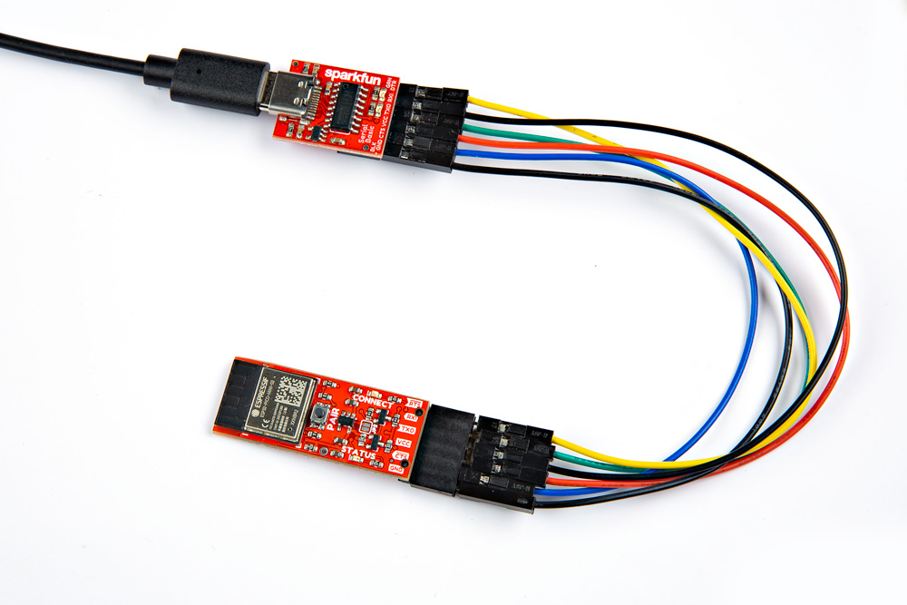

In this example, we will be using the [basic serial UART example from the SerLCD tutorial](https://learn.sparkfun.com/tutorials/avr-based-serial-enabled-lcds-hookup-guide/serial-uart-example-code---basic). However, the wires between the SparkFun RedBoard will be replaced with a pair of BlueSMiRF v2s.

<div style="text-align: center">
  <table>
    <tr>
      <td style="text-align: center; vertical-align: middle;">
        <a href="https://learn.sparkfun.com/tutorials/avr-based-serial-enabled-lcds-hookup-guide/serial-uart-example-code---basic">
          <div style="text-align: center"></div>
          <hr />
          <h3 style="text-align: left">
            <b>AVR-Based Serial Enabled LCDs Hookup Guide | Serial UART: Example Code - Basic</b>
          </h3>
        </a>
      </td>
    </tr>
  </table>
</div>

### Changing the Baud Rate

Before using the BlueSMiRFs with the SerLCD, we need to make sure that the baud rates match. You can either change the baud rate on both BlueSMiRFs or the baud rate of the SerLCD. To keep the original Arduino code the same, let's change the baud rate on both of the BlueSMiRFs. This will also be a good exercise to change the baud rate using the AT Commands.

Connect a USB-to-Serial converter to the BlueSMiRF. Depending on the BlueSMiRF that you have, you may need to solder headers. Then connect the USB cable between the converter and your computer.

<div style="text-align: center;">
  <table>
    <tr style="vertical-align:middle;">
     <td style="text-align: center; vertical-align: middle;"><a href="../assets/img/CH340_stackable_header_BlueSMiRF-v2.jpg"></a></td>
    </tr>
    <tr style="vertical-align:middle;">
     <td style="text-align: center; vertical-align: middle;"><i>USB-to-Serial Converter (CH340) to BlueSMiRF v2 Header with an Additional Stackable Header</i>
     </td>
    </tr>
  </table>
</div>

Open a serial terminal and connect to the COM port at **115200 baud**. Type <kbd>$$$</kbd> within 60 seconds of powering the BlueSMiRF to enter command mode.

<div style="text-align: center;">
  <table>
    <tr style="vertical-align:middle;">
     <td style="text-align: center; vertical-align: middle;"><a href="../assets/img/BlueSMiRF_v2_AT_Commands_1_b.JPG"></a></td>
    </tr>
    <tr style="vertical-align:middle;">
     <td style="text-align: center; vertical-align: middle;"><i>BlueSMiRF v2 Connected to Serial Terminal and in Command Mode</i></td>
    </tr>
  </table>
</div>

Type <kbd>AT-SerialSpeed=9600</kbd> to change the baud rate to match the SerLCD's baud rate (which is set to 9600 baud by default). Enter <kbd>ATW</kbd> to save the settings.

<div style="text-align: center;">
  <table>
    <tr style="vertical-align:middle;">
     <td style="text-align: center; vertical-align: middle;"><a href="../assets/img/BlueSMiRF_Changing_Baud_Rate_9600.JPG"></a></td>
    </tr>
    <tr style="vertical-align:middle;">
     <td style="text-align: center; vertical-align: middle;"><i>Configuring the Baud Rate of the BlueSMiRF v2</i></td>
    </tr>
  </table>
</div>

Now that the first BlueSMiRF v2 is configured, repeat the same steps explained above to change the baud rate of the second BlueSMiRF v2.


### Hardware Hookup

Replacing the connection with the BlueSMiRFs is similar to the basic serial UART connection listed earlier in this tutorial. We'll be using it as a guide to wire everything up. Since the SerLCD is only receiving data to display, we only need to use its RX pin.

From the microcontroller, you will need to wire the following pins. Since the BlueSMiRF v2 includes logic level circuitry on the TX and RX pins, we can wire the SparkFun RedBoard Plus directly to the pin when the switch for the microcontroller's logic level is set to 5V. Notice that we are only wiring software serial TX pin since we are just sending characters from the microcontroller to the SerLCD. Users that want to also connect software serial RX pin can also wire the connection to the BlueSMiRF v2's TXO but it is not necessary. We will assume that we are using power supplied from a USB port or USB power supply.

<div style="text-align: center;">
    <table>
        <tr>
            <th style="text-align: center; border: solid 1px #cccccc;">SparkFun RedBoard Plus<br />(ATmega328P) Pinout
            </th>
            <th style="text-align: center; border: solid 1px #cccccc;">Transmitting BlueSMiRF v2<br />Pinout
            </th>
        </tr>
        <tr>        
            <td style="text-align: center; border: solid 1px #cccccc;" bgcolor="#cce5ff"><font color="#000000">7</font>
            </td>
            <td style="text-align: center; border: solid 1px #cccccc;" bgcolor="#cce5ff"><font color="#000000">RXI</font>
            </td>
        </tr>
        <tr>
            <td style="text-align: center; border: solid 1px #cccccc;" bgcolor="#f2dede"><font color="#000000">5V</font>
            </td>
            <td style="text-align: center; border: solid 1px #cccccc;" bgcolor="#f2dede"><font color="#000000">VCC</font>
            </td>
        </tr>
        <tr>
            <td style="text-align: center; border: solid 1px #cccccc;" bgcolor="#DDDDDD"><font color="#000000">GND</font>
            </td>
            <td style="text-align: center; border: solid 1px #cccccc;" bgcolor="#DDDDDD"><font color="#000000">GND</font>
            </td>
        </tr>
    </table>
</div>

On the SerLCD side, we can simply insert the BlueSMiRF v2 in the SerLCD's USB-to-serial 1x6 header. For users that are using the BlueSMiRF v2 with headers and soldered male header pins on the SerLCD, you can place them in a breadboard. A 9V power supply and barrel jack adapter was used to power both boards. The + pin from the adapter was connected to the SerLCD's RAW pin which is regulated down to 3.3V. Of course, the - pin from the adapter was also connected for reference ground.

<div style="text-align: center;">
    <table>
        <tr>
            <th style="text-align: center; border: solid 1px #cccccc;">Receiving BlueSMiRF v2<br />Pinout
            </th>
            <th style="text-align: center; border: solid 1px #cccccc;">SparkFun 16x2 SerLCD<br />RGB Backlight (Qwiic) Pinout
            </th>
            <th style="text-align: center; border: solid 1px #cccccc;">Power Supply (5V TO 9V)<br />with Barrel Jack Adapter
            </th>
        </tr>
        <tr>        
            <td style="text-align: center; border: solid 1px #cccccc;" bgcolor="#cce5ff"><font color="#000000">TXO</font>
            </td>
            <td style="text-align: center; border: solid 1px #cccccc;" bgcolor="#cce5ff"><font color="#000000">RX</font>
            </td>
            <td style="text-align: center; border: solid 1px #cccccc;" bgcolor="#ffffff"><font color="#000000"></font>
            </td>
        </tr>
        <tr>
            <td style="text-align: center; border: solid 1px #cccccc;" bgcolor="#f2dede"><font color="#000000">VCC</font>
            </td>
            <td style="text-align: center; border: solid 1px #cccccc;" bgcolor="#f2dede"><font color="#000000">+</font>
            </td>
            <td style="text-align: center; border: solid 1px #cccccc;" bgcolor="#ffffff"><font color="#000000"></font>
            </td>
        </tr>
        <tr>
            <td style="text-align: center; border: solid 1px #cccccc;" bgcolor="#ffffff"><font color="#000000"></font>
            </td>
            <td style="text-align: center; border: solid 1px #cccccc;" bgcolor="#f2dede"><font color="#000000">RAW</font>
            </td>
            <td style="text-align: center; border: solid 1px #cccccc;" bgcolor="#f2dede"><font color="#000000">+, Center Positive Pin</font>
            </td>
        </tr>
        <tr>
            <td style="text-align: center; border: solid 1px #cccccc;" bgcolor="#DDDDDD"><font color="#000000">GND</font>
            </td>
            <td style="text-align: center; border: solid 1px #cccccc;" bgcolor="#DDDDDD"><font color="#000000">GND</font>
            </td>
            <td style="text-align: center; border: solid 1px #cccccc;" bgcolor="#DDDDDD"><font color="#000000">-, Sleeve</font>
            </td>
        </tr>
    </table>
</div>

If you have not already, make sure to upload the Arduino example code from the basic serial UART example. For your convenience, the code shown below was pulled from the [OpenLCD's Serial Examples folder](https://github.com/sparkfun/OpenLCD/blob/master/firmware/Examples/Serial/Example1_Serial_Basic/Example1_Serial_Basic.ino). Select the board (in this case, the **Tools** > **Board** > **Arduino AVR Boards (arduino) > Arduino Uno**) and COM port that the board enumerated to. Then hit the upload button.

``` c++ linenums="1"
--8<-- "https://raw.githubusercontent.com/sparkfun/OpenLCD/master/firmware/Examples/Serial/Example1_Serial_Basic/Example1_Serial_Basic.ino"
```

With both boards powered, follow the steps to [pair and connect the two BlueSMiRFs together](/button/pairing-mode). If all is well, you should see the RedBoard Plus transmitting the same message to the SerLCD. Instead of a wired connection, a pair of BlueSMiRF's were used!

<div style="text-align: center;">
  <table>
    <tr style="vertical-align:middle;">
     <td style="text-align: center; vertical-align: middle;"><a href="../assets/img/24113-RedBoard_ATMega328P_Plus_BlueSMiRF_V2_RGB_SerLCD.jpg"></a></td>
    </tr>
    <tr style="vertical-align:middle;">
     <td style="text-align: center; vertical-align: middle;"><i>Wireless Serial LCD with the RedBoard Plus</i>
     </td>
    </tr>
  </table>
</div>

Try adding a Qwiic-enabled device like the Human Presence and Motion Sensor - (STHS34PF80) to the RedBoard Plus and writing code to display a message notifying you when someone has passed by a door. Then place the SerLCD by your desk so that you can monitor the traffic.
