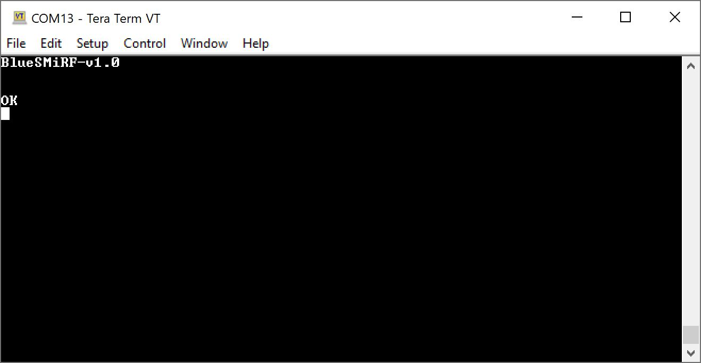

Each BlueSMiRF v2 firmware comes with a set of AT commands to read or change the configuration. The following set of AT commands are similar to previous BlueSMiRF AT commands. Let's go over some of these commands!

## AT Commands

!!! note
    Command mode cannot be entered for **60 seconds** after power-on or resetting the device. This setting can be changed with the `AT-MaxCommandTimeMs` command.

BlueSMiRF radios are very flexible. By default, the radio is looking for serial communication at **115200** bps. Open the [terminal](https://learn.sparkfun.com/tutorials/terminal-basics) of your choice. Then enter `$$$` and wait for an `OK`. Both the CONNECT and STATUS LEDs will fade in and fade out whenever the board is in Command Mode. At this point, the radio is now ready for an AT command.

<figure markdown>
[{ width="600" }](./assets/img/example-terminal-command_mode.jpg "Click to enlarge")
<figcaption markdown>Response acknowledging user is in command mode.</figcaption>
</figure>

!!! note
	Depending on your serial terminal's settings, you may not see the characters that are being sent. You can try turning on the local echo to view the characters. However, keep in mind that any characters sent when the BlueSMiRF v2 is in command mode will already be echoed back.

!!! note
	 The device can also be configured by connecting over Bluetooth and entering `$$$`.

Below is a brief list of commands. The BlueSMiRF will recognize commands with capital and lower case letters since the commands are not case sensitive.

| AT Command           | Command Description                             |
| :------------------: | :---------------------------------------------- |
| `$$$`                | Enter Command Mode                              |
| `AT`                 | Reports OK                                      |
| `AT?`                | Display this help text                          |
| `ATA`                | Display all settings                            |
| `ATB`                | Display Bluetooth settings                      |
| `ATC`                | Check for new firmware                          |
| `ATD`                | Display the debug settings                      |
| `ATF`                | Restore factory settings                        |
| `ATM`                | Display MAC address                             |
| `ATP`                | Start pairing process                           |
| `ATS`                | Display serial settings                         |
| `ATU`                | Update Firmware                                 |
| `ATV`                | Display firmware version                        |
| `ATW`                | Save current settings to NVM                    |
| `ATX`                | Exit command mode                               |
| `ATY`                | Display system settings                         |
| `ATZ`                | Reboot the system                               |
| `AT-<Param>=<value>` | Set parameter's value to xxx by name (Param)    |
| `AT-<Param>?`        | Print parameter's current value by name (Param) |
| `AT-?`               | Display the setting values                      |

A parameter `<Param>` is set using the **AT-** prefix, followed by the name of the command with an equals sign and the value to set. For example, sending **AT-SerialSpeed=115200** followed by the ++enter++ key (or a carriage return) will change the serial interface speed to 115200bps. This setting can be stored in NVM (non-volatile memory) by sending the **ATW** command.

To query a setting, send the AT command without a value and the device will respond with the current value. For example, sending **AT-SerialSpeed** followed by the ++enter++ key will generate the response **115200** followed by **OK**.

The commands are best discussed in groups:

- [Bluetooth Commands](#bluetooth-commands)
- [Serial Commands](#serial-commands)
- [System Commands](#serial-commands)

<!--
- Firmware Commands
- Debug Commands

-->

### Bluetooth Commands
Below is a table for Bluetooth commands, a short description of the command, and its factory default value (if applicable). Right after the table, there is also a list which provides a detailed explanation of each parameter as well.

| AT Command                     | Command Description                                                         | Factory Default Value |
| :----------------------------: | :-------------------------------------------------------------------------- | :-------------------: |
| `AT-BluetoothConnectRetries`   | Number of retries of a paired connection                                    | 5                     |
| `AT-BluetoothConnectTimeoutMs` | Milliseconds before a paired connection attempt times out                   | 3000                  |
| `AT-BluetoothEscapeCharacter`  | The character received from the remote system, sought to enter command mode | $                     |
| `AT-BluetoothNickname`         | User configurable name to broadcast over Bluetooth during discovery         | `BlueSMiRF-ABCD`, where `ABCD` is the last four digits of the MAC address |
| `AT-BluetoothPairedMac`        | MAC address of the unit that the user wants to connect to at startup        |                       |
| `AT-BluetoothPairedName`       | Name of the unit that the user wants to connect to at startup               |                       |
| `AT-BluetoothPin`              | Pin to enter during pairing - only required for older Bluetooth devices     | 1234                  |
| `AT-BluetoothRxSize`           | Bluetooth receive buffer size                                               | 2048                  |
| `AT-BluetoothTxSize`           | Bluetooth write buffer size                                                 | 1024                  |
| `AT-BluetoothType`             | Bluetooth protocol used for communication                                   | 0                     |

- **BluetoothConnectRetries**
:   If this device has a paired MAC or name, at power up it will attempt to connect to this paired device. A connection is not guaranteed, and the connection will be re-tried this number of times before going into passive, discoverable mode.
- **BluetoothConnectTimeoutMs**
:   When this device is connecting to a paired device, if this number of milliseconds expires before a connection is made, the device will attempt to reconnect to the paired device.
- **BluetoothEscapeCharacter**
:   This is the character that must be transmitted by a remote device to enter command mode remotely over the Bluetooth connection.

	!!! note
		Escape characters are ignored after `MaxCommandTimeMs` number of milliseconds and within `MinEscapeTimeMs` of other incoming characters.

- **BluetoothNickname**
:   The name that is broadcast when other devices are scanning for devices to pair to.
- **BluetoothPairedMac**
:   The MAC address of the BlueSMiRF that this device should pair to at power-on. Use the `ATM` command on the remote device to display its MAC address. This command is not normally used; use the button pairing method for an easier way to pair two devices.
- **BluetoothPairedName**
:   The name of the BlueSMiRF that this device should pair to at power-on. Use the `BluetoothNickname` command on the remote device to change its paired name. This command is not normally used; use the button pairing method for an easier way to pair two devices.
- **BluetoothPin**
:   The pin that is needed during pairing. Only needed on very old Bluetooth USB dongles.
- **BluetoothRxSize**
:   The size of the Bluetooth receive buffer. Increase if a large amount of data is coming into the BlueSMiRF over Bluetooth, before the speed of the serial interface can output it.
- **BluetoothTxSize**
:   The size of the Bluetooth transmit buffer. Increase if a large amount of data needs to be transmitted over Bluetooth but the connection between devices is poor and multiple retransmissions occur.
- **BluetoothType**
:   Controls the Bluetooth protocol. This parameter accepts a `0`, `1`, and `2` for the Bluetooth Protocol as listed below. Note that only the SPP protocol supports pairing.

	- Protocol `0` = Serial Port Profile (SPP)
	- Protocol `1` = Bluetooth Low-Energy (BLE)
	- Protocol `2` = Radio off

### Serial Commands
Below is a table for serial commands, a short description of the command, and its factory default value (if applicable). Right after the table, there is also a list which provides a detailed explanation of each parameter as well.

| AT Command                    | Command Description                                                | Factory Default Value |
| :---------------------------: | :----------------------------------------------------------------- | :-------------------: |
| `AT-FlowControl`              | Enable the use of CTS/RTS flow control signals                     | 0                     |
| `AT-InvertCts`                | Invert the input of CTS                                            | 0                     |
| `AT-InvertRts`                | Invert the output of RTS                                           | 0                     |
| `AT-PartialFrameTimeoutMs`    | Send partial buffer if time expires                                | 50                    |
| `AT-RtsStartSendingPercent`   | Percent of serialReceiveBuffer that is free when RTS is asserted   | 25                    |
| `AT-RtsStopSendingPercent`    | Percent of serialReceiveBuffer that is free when RTS is deasserted | 5                     |
| `AT-SerialReceiveBufferSize`  | Serial receive buffer size                                         | 51200                 |
| `AT-SerialSpeed`              | The baud rate that the BlueSmiRF operates at.                      | 115200                |
| `AT-SerialTransmitBufferSize` | Buffer size to receive bytes from Bluetooth                        | 10240                 |

- **FlowControl** - If flow control is enabled, the BlueSMiRF v2 will send data when its CTS pin is driven low (the host system is telling the radio to transmit). If flow control is enabled, BlueSMiRF v2 will drive its RTS low if its serial buffer is full (the radio is telling the host system to hold its horses). By default, flow control is turned off.
- **InvertCts** - By default, InvertCts is false and CTS is high when data is allowed to flow. Enable InvertCts to do the opposite.
- **InvertRts** - By default, InvertRts is false and RTS is high when data is allowed to flow. Enable InvertRts to do the opposite.
- **PartialFrameTimeoutMs** - The number of milliseconds of timeout before a partial packet is sent. For example, if a partial frame of 12 bytes is received, the radio will wait this amount for more bytes before initiating a transmission.
- **RtsStartSendingPercent** - Percent of serialReceiveBuffer that is free when RTS is asserted. Default of 25% of serialReceiveBuffer.
- **RtsStopSendingPercent** - Percent of serialReceiveBuffer that is free when RTS is deasserted. Default of 5% of serialReceiveBuffer.
- **SerialReceiveBufferSize** - Buffer size to receive serial data from the serial port, to be sent over Bluetooth. The default is 51200.
- **SerialSpeed** - The baud rate that the BlueSMiRF operates at. Discrete values 2400, 4800, 9600, 14400, 19200, 38400, 57600, 115200 (default), 230400, 460800, and 921600bps are allowed.  - **SerialTransmitBufferSize** - Buffer size to receive bytes from Bluetooth, waiting to be printed out the UART. The default is 10240.

### System Commands
Below is a table for system commands, a short description of the command, and its factory default value (if applicable). Right after the table, there is also a list which provides a detailed explanation of each parameter as well.

| AT Command                | Command Description                                                                           | Factory Default Value |
| :-----------------------: | :-------------------------------------------------------------------------------------------- | :-------------------: |
| `AT-EscapeCharacter`      | The character sought to enter command mode                                                    | $                     |
| `AT-EscapeCharacterCount` | The number of escape characters required to enter command mode                                | 3                     |
| `AT-LedStyle`             | Controls the behavior of the Status and Connect LEDs                                          | 0                     |
| `AT-MaxCommandTimeMs`     | After this time in milliseconds, command mode cannot be entered                               | 60000                 |
| `AT-MinEscapeTimeMs`      | Serial traffic must stop this amount of milliseconds before an escape character is recognized | 2000                  |
| `AT-WiFiPassword`         | Password for the SSID, used for over-the-air-updates                                          |                       |
| `AT-WiFiSSID`             | SSID used for over-the-air-updates                                                            |                       |

- **EscapeCharacter**
:   The character that must be entered a number of times (`EscapeCharacterCount`) to enter configuration mode. An escape character must be entered before the max time of `MaxCommandTimeMs` and after `MinEscapeTimeMs`.
- **EscapeCharacterCount**
:   The number of escape characters needed before command mode is entered. Set to 0 to disable.
- **LedStyle** - Controls how the LEDs behave: CLASSIC = `0`, SERIAL_TRAFFIC = `1`, OFF = `2`.
	- **CLASSIC mode (default)** = `0`
:   The **STATUS** LED blinks with TX/RX traffic.
	- **SERIAL_TRAFFIC mode** = `1`
:   The **CONNECT** LED blinks with TX traffic and the **STATUS** LED blinks with RX traffic.
	- **OFF mode** = `2`
:   The **CONNECT** and **STATUS** LEDs are turned off.
- **MaxCommandTimeMs**
:   Once this number of milliseconds has passed, command mode cannot be entered. This is used as a method to prevent a remote system from accidentally entering command mode.
- **MinEscapeTimeMs**
:   This number of milliseconds must pass between the last serial character received and an escape character. This is used as a method to prevent a remote system from accidentally entering command mode.
- **WiFiPassword**
:   The password for the local WiFi used for firmware updates.
- **WiFiSSID**
:   The SSID for the local WiFi used for firmware updates.
