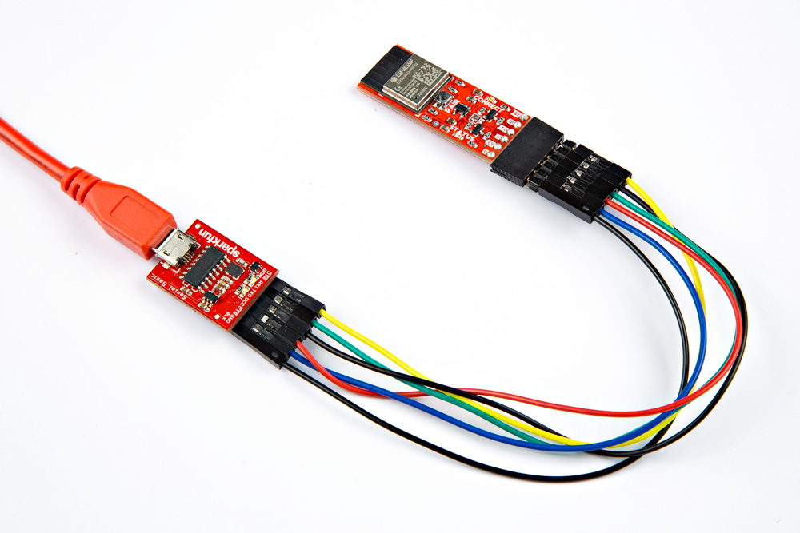

In this example, we will connect two BlueSMiRF v2 boards to two separate serial ports. We will then send characters from one serial terminal to a second serial terminal.

The image below on the left shows the Serial Basic (CH340, USB-C) connected to the BlueSMiRF v2 Header using M/F jumper wires. Headers were used to easily remove and reconnect the BlueSMiRF v2 with headers. The image to the right shows the Serial Basic (CH340, micro-B) connected to the BlueSMiRF v2 PTH using M/F jumper wires. A row of female headers were soldered on the board. Extra long headers were placed between the female headers to easily remove and reconnect the BlueSMiRF v2 PTH as well.

  <table>
    <tr style="vertical-align:middle;">
     <td style="text-align: center; vertical-align: middle;"></td>
     <td style="text-align: center; vertical-align: middle;"></td>
    </tr>
    <tr style="vertical-align:middle;">
     <td style="text-align: center; vertical-align: middle;"><i>USB-to-Serial Converter (CH340) to BlueSMiRF v2 Header with an Additional Stackable Header</i>
     </td>
     <td style="text-align: center; vertical-align: middle;"><i>USB-to-Serial Converter (CH340) to BlueSMiRF v2 PTH</i>
     </td>
    </tr>
  </table>

!!! note
    To distinguish between the two BlueSMiRFs, try labeling the two board. In this case, we chose had the one with male headers and the other one with female headers.

Connect the first BlueSMiRF v2 to your computer's COM port. In this case, it was **COM13**. Press and hold the PAIR button between **4 to 8 seconds**. The Status and Connect LEDs will slowly blink back and forth. The Connect LED will begin to fade in and out after a few seconds. Open a serial terminal and connect to the first BlueSMiRF at **115200 baud**.

  <table>
    <tr style="vertical-align:middle;">
     <td style="text-align: center; vertical-align: middle;"></td>
    </tr>
    <tr style="vertical-align:middle;">
     <td style="text-align: center; vertical-align: middle;">
       <i>First Serial Terminal</i>
     </td>
    </tr>
  </table>

At this point, connect the second BlueSMiRF v2 to your computer's COM port. In this case, it was **COM18**. Press and hold the second BlueSMiRF's PAIR button between **4 to 8 seconds**. The second BlueSMiRF will scan the area for another BlueSMiRF and connect. Once connected, the **Connect** LEDs on both boards will remain solid. Open a second serial terminal, and connect to the second BlueSMiRF at **115200 baud**. Move both serial terminals side by side.

  <table>
    <tr style="vertical-align:middle;">
     <td style="text-align: center; vertical-align: middle;"></td>
    </tr>
    <tr style="vertical-align:middle;">
     <td style="text-align: center; vertical-align: middle;">
       <i>Second Serial Terminal</i>
     </td>
    </tr>
  </table>

Start typing characters in the first serial terminal. You should see them in the second serial terminal!

  <table>
    <tr style="vertical-align:middle;">
     <td style="text-align: center; vertical-align: middle;"></td>
     <td style="text-align: center; vertical-align: middle;"></td>
    </tr>
    <tr style="vertical-align:middle;">
     <td style="text-align: center; vertical-align: middle;"><i>Sending Characters through First Terminal</i>
     </td>
     <td style="text-align: center; vertical-align: middle;"><i>Receiving Characters through Second Terminal</i>
     </td>
    </tr>
  </table>

Type a message in the second terminal window. You should see them in the first serial terminal!

  <table>
    <tr style="vertical-align:middle;">
     <td style="text-align: center; vertical-align: middle;"></td>
     <td style="text-align: center; vertical-align: middle;"></td>
    </tr>
    </tr>
    <tr style="vertical-align:middle;">
     <td style="text-align: center; vertical-align: middle;"><i>Receiving Characters through First Serial Terminal</i>
     </td>
     <td style="text-align: center; vertical-align: middle;"><i>Sending Characters through Second Terminal</i>
     </td>
    </tr>
  </table>

