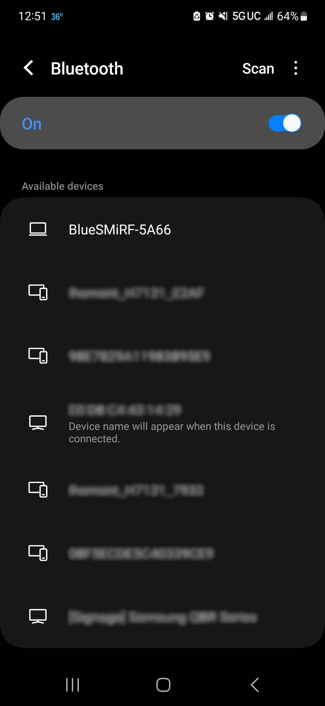
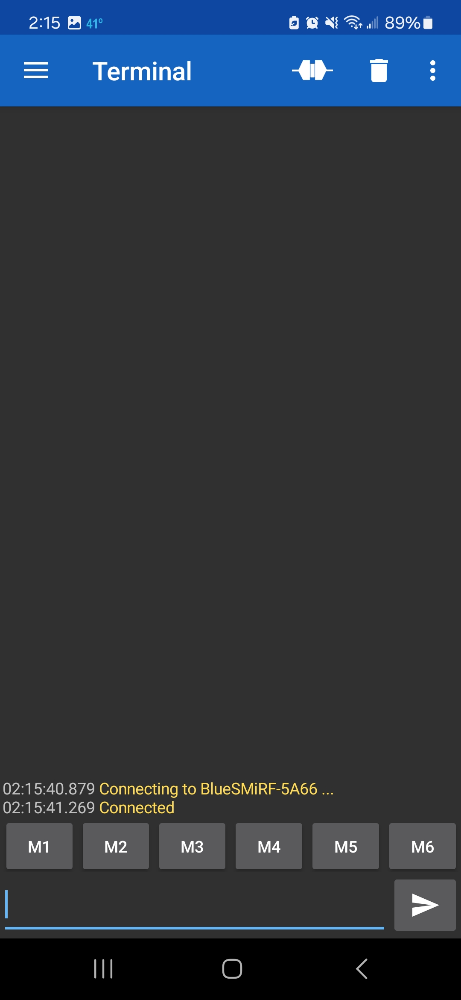
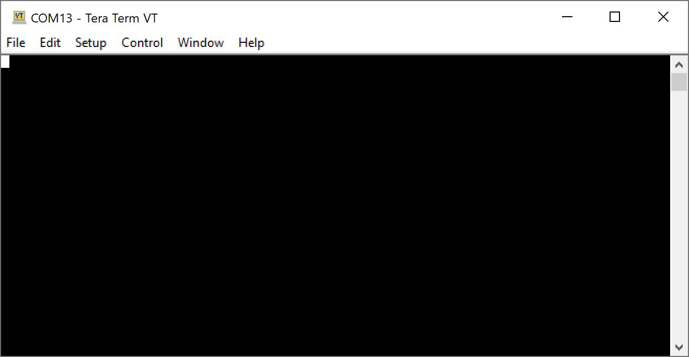
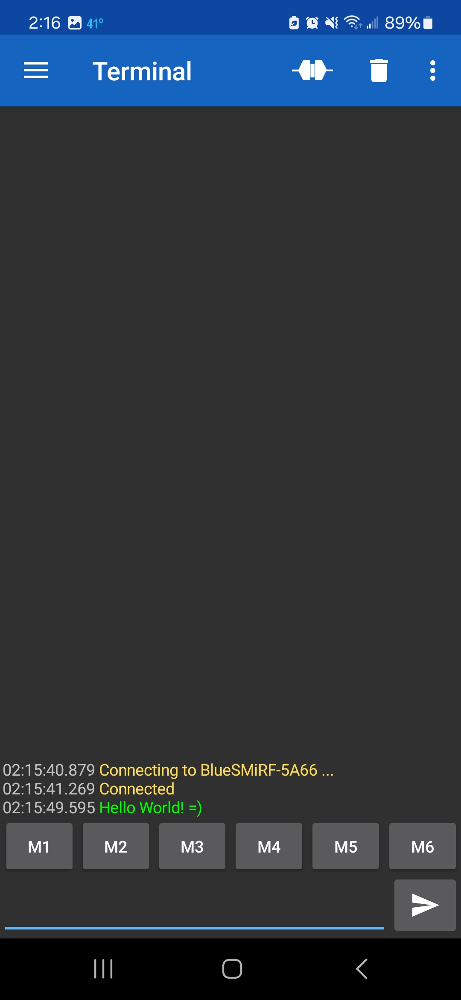
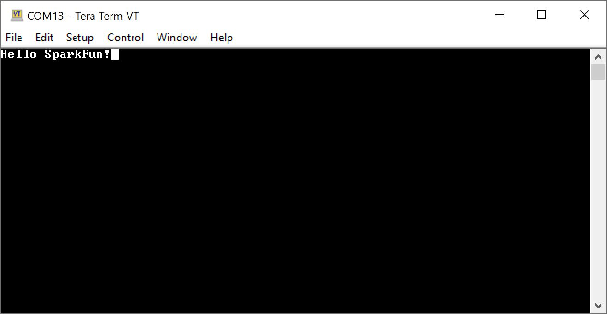
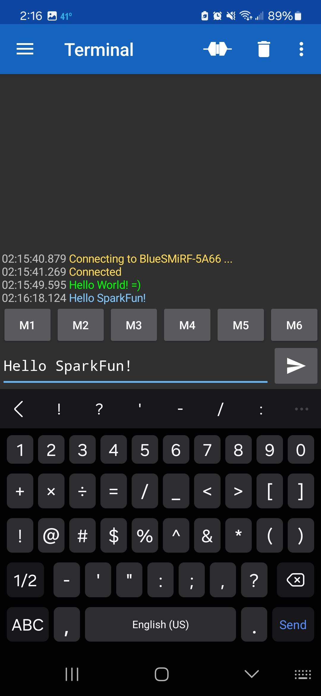

In this example, we will connect a BlueSMiRF v2 to a smartphone.

The image below shows the Serial Basic (CH340, USB-C) connected to the BlueSMiRF v2 Header using M/F jumper wires. Headers were used to easily remove and reconnect the BlueSMiRF v2 with headers.

  <table>
    <tr style="vertical-align:middle;">
     <td style="text-align: center; vertical-align: middle;"></td>
    </tr>
    <tr style="vertical-align:middle;">
     <td style="text-align: center; vertical-align: middle;"><i>BlueSMiRF v2 to SmartPhone Bluetooth Classic Serial Terminal</i>
     </td>
    </tr>
  </table>

### Download the Serial Bluetooth Terminal App

Head to your smartphone's app store. In this case, we were on an Android smartphone and used Google Play Store to download the [**Serial Bluetooth Terminal** app](https://play.google.com/store/apps/details?id=de.kai_morich.serial_bluetooth_terminal&hl=en_US&gl=US&pli=1).

<a href="https://play.google.com/store/apps/details?id=de.kai_morich.serial_bluetooth_terminal&hl=en_US&gl=US&pli=1" class="md-button">Google Play: Serial Bluetooth Terminal</a>

!!! note
    If you have a different phone OS, there are many apps like the Serial Bluetooth Terminal available for different smartphones. Just do a search in your app store.

### Pair the BlueSMiRF v2 with your Smartphone

Once downloaded, turn on your Bluetooth and open your Bluetooth settings. Scroll down until you see the available devices. With BlueSMiRF powered up and in range, you should be able to see the device in discoverable mode listed as **BlueSMiRF-ABCD**, where **ABCD** is the last four hex digits of the Bluetooth MAC. In this case, it was **BlueSMiRF-5A66**.

  <table>
    <tr style="vertical-align:middle;">
     <td style="text-align: center; vertical-align: middle;"></td>
    </tr>
    <tr style="vertical-align:middle;">
     <td style="text-align: center; vertical-align: middle;"><i>BlueSMiRF Discovered on Android Smartphone</i>
     </td>
    </tr>
  </table>

Click on the device to begin pairing. A message will pop up asking if you want to pair with the device. At this point, select "Pair."

  <table>
    <tr style="vertical-align:middle;">
     <td style="text-align: center; vertical-align: middle;"></td>
    </tr>
    <tr style="vertical-align:middle;">
     <td style="text-align: center; vertical-align: middle;"><i>BlueSMiRF Discovered on Android Smartphone</i>
     </td>
    </tr>
  </table>

Scroll up to your Paired devices and look for the BlueSMiRF to verify that it has paired with your phone.

  <table>
    <tr style="vertical-align:middle;">
     <td style="text-align: center; vertical-align: middle;"></td>
    </tr>
    <tr style="vertical-align:middle;">
     <td style="text-align: center; vertical-align: middle;"><i>BlueSMiRF-5A66 Showing Up as a Paired Bluetooth Device</i>
     </td>
    </tr>
  </table>

### Sending Characters Between a BlueSMiRF and Smartphone

Open the Serial Bluetooth Terminal app.

  <table>
    <tr style="vertical-align:middle;">
     <td style="text-align: center; vertical-align: middle;"></td>
    </tr>
    <tr style="vertical-align:middle;">
     <td style="text-align: center; vertical-align: middle;"><i>Serial Bluetooth Terminal Opened</i>
     </td>
    </tr>
  </table>

Click on the connect icon to the left of the trash can icon. If all is well, you will get a message indicating that the BlueSMiRF is connected.

  <table>
    <tr style="vertical-align:middle;">
     <td style="text-align: center; vertical-align: middle;"></td>
    </tr>
    <tr style="vertical-align:middle;">
     <td style="text-align: center; vertical-align: middle;"><i>Connected to BlueSMiRF-5A66</i>
     </td>
    </tr>
  </table>

Open a serial terminal, and connect to the BlueSMiRF at **115200 baud**. In this case, it was connected to **COM13**. Start typing characters in the serial terminal. You should see them in the Serial Bluetooth Terminal app!

  <table>
    <tr style="vertical-align:middle;">
     <td style="text-align: center; vertical-align: middle;"></td>
     <td style="text-align: center; vertical-align: middle;"></td>
    </tr>
    <tr style="vertical-align:middle;">
     <td style="text-align: center; vertical-align: middle;">
       <i>Serial Terminal Connected to BlueSMiRF v2</i>
     </td>
     <td style="text-align: center; vertical-align: middle;"><i>Receiving Characters through the Serial Bluetooth Terminal </i>
     </td>
    </tr>
  </table>

Type a message and send them using the Serial Bluetooth Terminal app. You should see the message in the serial terminal!

  <table>
    <tr style="vertical-align:middle;">
     <td style="text-align: center; vertical-align: middle;"></td>
     <td style="text-align: center; vertical-align: middle;"></td>
    </tr>
    <tr style="vertical-align:middle;">
      <td style="text-align: center; vertical-align: middle;"><i>Receiving Characters through First Serial Terminal</i>
      <td style="text-align: center; vertical-align: middle;"><i>Sending Characters through Serial Bluetooth Terminal</i>
     </td>
    </tr>
  </table>

Sending serial data between the BlueSMiRF and smartphone using the Serial Bluetooth Terminal app is only the start! For example, you can use BlueSMiRF v2 and a smartphone to send/receive correction data to/from a high precision GNSS module. Try looking at the following methods to send data between the BlueSMiRF v2 and a smartphone. Just make sure to adjust the baud rate of the BlueSMiRF to match the high precision GNSS module's baud rate (for the u-blox modules, the correction port's default is typically set to **38400 baud**). These are only a few ways to connect a high precision GNSS module to your smartphone's GNSS app to achieve an RTK Fixed Mode.

* [Connecting the ZED-F9P to a Correction Source using an NTRIP Client](https://learn.sparkfun.com/tutorials/gps-rtk2-hookup-guide#connecting-the-zed-f9p-to-a-correction-source)
* [Setting the ZED-F9P as a Correction Source](https://learn.sparkfun.com/tutorials/gps-rtk2-hookup-guide#setting-the-zed-f9p-as-a-correction-source)
