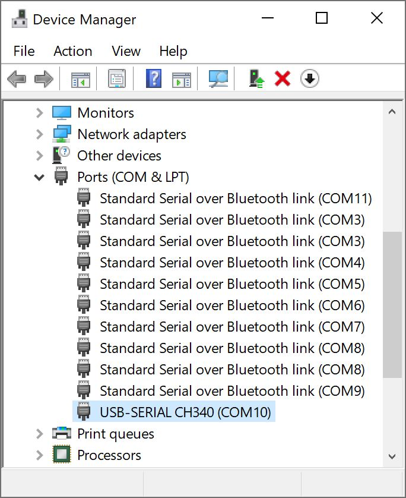
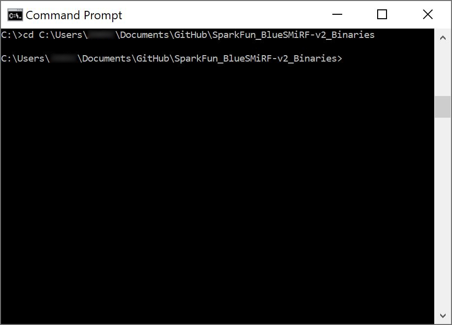
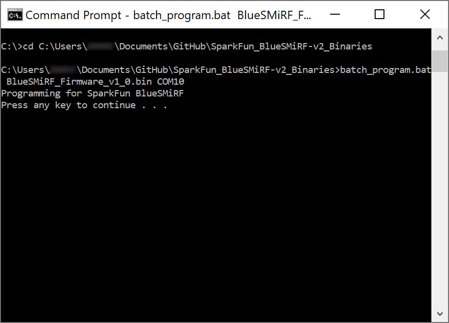
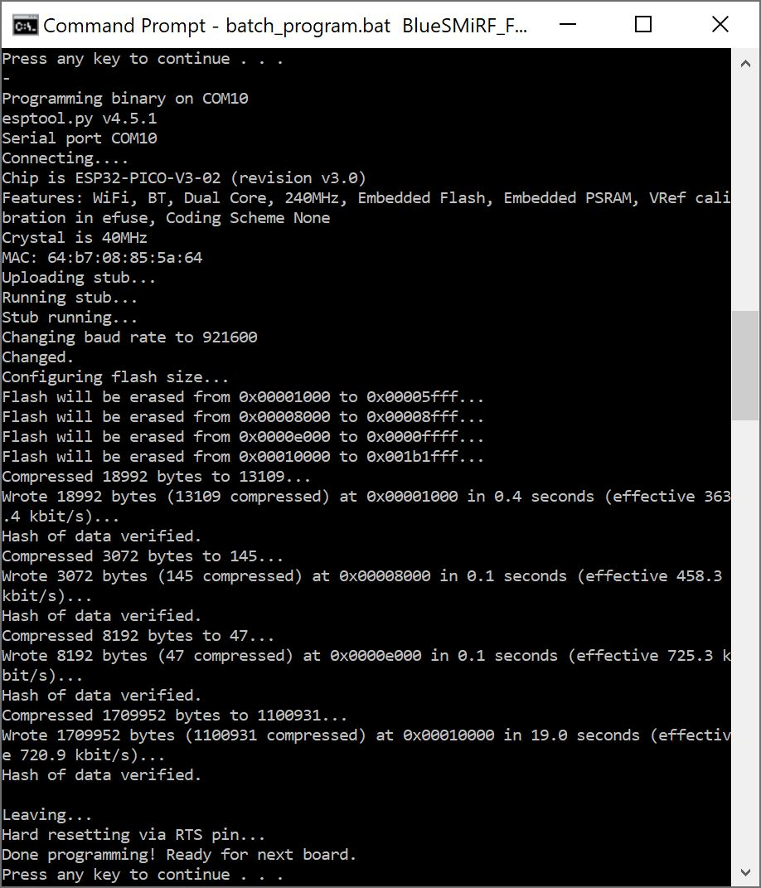

From time to time, SparkFun will release new firmware for the BlueSMiRF v2 product line to add and improve functionality. For most users, firmware can be upgraded over a 2.4GHz WiFi network using the [OTA method](#updating-firmware-over-the-air-ota). Users can also update the firmware manually using a Command Line Interface (CLI)


## Over-The-Air (OTA)

Once the `AT-WiFiSSID` and `AT-WiFiPassword` settings have been entered for your local WiFi network, the `ATC` command can be issued to check for new firmware. If new firmware is available, send the `ATU` command to begin an update.

## Serial Interface

Because it's much easier to use, we recommend the OTA firmware update process. If that fails for some reason, the following CLI method can be used.


### Bootloader Mode

Hold the ++"PAIR"++ button while powering the BlueSMiRF v2. This will cause the ESP32 to enter bootloader mode. Once the BlueSMiRF v2 is in bootloader mode, the **STATUS** LED will be dimly lit and the **CONNECT** LED will be off.

We recommend using a [breadboard](https://www.sparkfun.com/products/12002) or [jumper wires](https://www.sparkfun.com/products/11026) to connect the BlueSMiRF to a [USB-to-Serial](https://www.sparkfun.com/products/15096) connection. At a minimum, you will need to connect the UART pins, power, and ground as stated in the hardware hookup. Remember, the TX and RX connections must be crossed over.

<div style="text-align: center;">
	<table>
		<tr>
			<th style="text-align: center; border: solid 1px #cccccc;">USB-to-Serial Converter<br />Pinout
			</th>
			<th style="text-align: center; border: solid 1px #cccccc;" colspan="2">Intermediate Wire Connection</th>
			<th style="text-align: center; border: solid 1px #cccccc;">BlueSMiRF v2<br />Pinout
			</th>
		</tr>
		<tr>
			<td style="text-align: center; border: solid 1px #cccccc;">DTR
			</td>
			<td style="text-align: center; border: solid 1px #cccccc;">
			<td style="text-align: center; border: solid 1px #cccccc;">
			<td style="text-align: center; border: solid 1px #cccccc;"><span STYLE="text-decoration:overline">RTS</span>
			</td>
		</tr>
		<tr>
			<td style="text-align: center; border: solid 1px #cccccc;" bgcolor="#cce5ff"><font color="#000000">RXI</font>
			</td>
			<td style="text-align: center; border: solid 1px #cccccc;" bgcolor="#cce5ff">
			</td>
			<td style="text-align: center; border: solid 1px #cccccc;" bgcolor="#fff3cd">
			</td>
			<td style="text-align: center; border: solid 1px #cccccc;" bgcolor="#fff3cd"><font color="#000000">RXI</font>
			</td>
		</tr>
		<tr>
			<td style="text-align: center; border: solid 1px #cccccc;" bgcolor="#fff3cd"><font color="#000000">TXO</font>
			</td>
			<td style="text-align: center; border: solid 1px #cccccc;" bgcolor="#fff3cd">
			</td>
			<td style="text-align: center; border: solid 1px #cccccc;" bgcolor="#cce5ff">
			</td>
			<td style="text-align: center; border: solid 1px #cccccc;" bgcolor="#cce5ff"><font color="#000000">TXO</font>
			</td>
		</tr>
		<tr>
			<td style="text-align: center; border: solid 1px #cccccc;" bgcolor="#f2dede"><font color="#000000">3V3</font>
			</td>
			<td style="text-align: center; border: solid 1px #cccccc;" bgcolor="#f2dede">
			</td>
			<td style="text-align: center; border: solid 1px #cccccc;" bgcolor="#f2dede">
			</td>
			<td style="text-align: center; border: solid 1px #cccccc;" bgcolor="#f2dede"><font color="#000000">VCC</font>
			</td>
		</tr>
		<tr>
			<td style="text-align: center; border: solid 1px #cccccc;">CTS
			</td>
			<td style="text-align: center; border: solid 1px #cccccc;">
			</td>
			<td style="text-align: center; border: solid 1px #cccccc;">
			</td>
			<td style="text-align: center; border: solid 1px #cccccc;">CTS
			</td>
		</tr>
		<tr>
			<td style="text-align: center; border: solid 1px #cccccc;" bgcolor="#DDDDDD"><font color="#000000">GND</font>
			</td>
			<td style="text-align: center; border: solid 1px #cccccc;" bgcolor="#DDDDDD">
			</td>
			<td style="text-align: center; border: solid 1px #cccccc;" bgcolor="#DDDDDD">
			</td>
			<td style="text-align: center; border: solid 1px #cccccc;" bgcolor="#DDDDDD"><font color="#000000">GND</font>
			</td>
		</tr>
	</table>
</div>


!!! note
	To automatically trigger the reset of the ESP32, users can connect the `DTR` pin from the USB-to-Serial converter to the [`RST` reset pin on the BlueSMiRF](hardware_overview.md#reset).


<figure markdown>
[{ width="600" }](./assets/img/assembly-smd-uart_adapter-alt.jpg "Click to enlarge")
<figcaption markdown>USB-to-Serial Converter (CH340) to BlueSMiRF v2 Header with an Additional Stackable Header</figcaption>
</figure>


### Windows

Identify the COM port the USB-to-Serial device enumerated at. The easiest way to do this is to open the Device Manager under the **Ports (COM & LPT)** tree:


<figure markdown>
[{ width="300" }](./assets/img/firmware-device_manager.jpg "Click to enlarge")
<figcaption markdown>CH340 is on COM10 as shown in Device Manager</figcaption>
</figure>


If the COM port is not showing, be sure the unit is turned **On**. If an unknown device is appearing, you’ll need to install drivers for your USB-to-serial device ([we'll assume that you are using the CH340](https://learn.sparkfun.com/tutorials/how-to-install-ch340-drivers/all)).

Once the correct COM port is identified, head to the [GitHub repo for the BlueSMiRF v2 binaries](https://github.com/sparkfun/SparkFun_BlueSMiRF-v2_Binaries) and download all the contents. Unzip the contents in a known directory and copy the path.


<article style="text-align: center;" markdown>
[Download BlueSMiRF v2 Binaries GitHub Repo (ZIP)](https://github.com/sparkfun/SparkFun_BlueSMiRF-v2_Binaries/archive/main.zip){ .md-button .md-button--primary }
</article>


Open a command prompt (++win++ + ++r++ then type `cmd`). Head to the directory where you unzipped the folder. You'll need to use the `cd` commmand, paste the path where you unzipped the folder, and hit the ++enter++ key.


<figure markdown>
[{ width="600" }](./assets/img/firmware-repository_directory.jpg "Click to enlarge")
<figcaption markdown>Change Path to BlueSmiRF Binaries Folder</figcaption>
</figure>


You'll then need to run the '**batch_program.bat**' along with the binary file name and COM port. Enter the following command below, where **COM4** should be replaced by the COM port you identified earlier and **BlueSMiRF_Firmware_v1_0.bin** is the firmware that you are updating to. Make sure to send an additional key to run the batch file.


```sh
batch_program.bat BlueSMiRF_Firmware_v1_0.bin COM4
```


<figure markdown>
[{ width="600" }](./assets/img/firmware-execute_batch.jpg "Click to enlarge")
<figcaption markdown>`batch_program.bat` running `esptool`</figcaption>
</figure>


After about 20 seconds, you should see the following message: `Done programming! Ready for next board.`


<figure markdown>
[{ width="600" }](./assets/img/firmware-upload_complete.jpg "Click to enlarge")
<figcaption markdown>Successfully Programmed BlueSMiRF v2 - ESP32</figcaption>
</figure>


The batch file runs the following commands, where `COM4` is replaced with the COM port that the BlueSMiRF product enumerated at and `BlueSMiRF_Firmware_vx_x.bin` is the firmware you would like to load.


```sh
esptool.exe --chip esp32 --port COM4 --baud 921600 --before default_reset --after hard_reset write_flash -z --flash_mode dio --flash_freq 80m --flash_size 8MB 0x1000 bins/bootloader.bin 0x8000 bins/partitions.bin 0xe000 bins/boot_app0.bin 0x10000 BlueSMiRF_Firmware_v1_0.bin
```


!!! note
	Some users have reported the `921600` baud rate does not work. Decrease this to `115200` as needed.


!!! tip
	Finished programming the ESP32? Type ++ctrl++ + ++c++ , ++y++ , and ++enter++ to exit the batch file. You can also close the window.


Upon completion, the BlueSMiRF v2 must be power cycled to exit bootloader mode. Once power cycled, the BlueSMiRF will start running the new firmware.

!!! note
	We recommend disconnecting the USB cable from the USB-to-Serial Converter or your computer's COM port.


### macOS / Linux

Get [esptool.py](https://github.com/espressif/esptool). Connect a USB A to C cable from your computer to the USB-to-Serial. Now identify the COM port the USB-to-serial device enumerated at.

If the COM port is not showing, be sure the unit is turned **On**. If an unknown device is appearing, you’ll need to install drivers for your USB-to-serial device ([we'll assume that you are using the CH340](https://learn.sparkfun.com/tutorials/how-to-install-ch340-drivers/all)).

Once the correct COM port is identified, head to the [GitHub repo for the BlueSMiRF v2 binaries](https://github.com/sparkfun/SparkFun_BlueSMiRF-v2_Binaries) and download all the contents. Unzip the contents in a known directory and copy the path.


<article style="text-align: center;" markdown>
[Download BlueSMiRF v2 Binaries GitHub Repo (ZIP)](https://github.com/sparkfun/SparkFun_BlueSMiRF-v2_Binaries/archive/main.zip){ .md-button .md-button--primary }
</article>


Open a Terminal window and run the following command, where `/dev/ttyUSB0` is replaced with the port that the USB-to-Serial board enumerated at and `BlueSMiRF_Firmware_vx_x.bin` is the firmware you would like to load.

```sh
py esptool.py --chip esp32 --port /dev/ttyUSB0 --baud 921600 --before default_reset --after hard_reset write_flash -z --flash_mode dio --flash_freq 80m --flash_size 8MB 0x1000 bins/bootloader.bin 0x8000 bins/partitions.bin 0xe000 bins/boot_app0.bin 0x10000 BlueSMiRF_Firmware_vx_x.bin
```


!!! note
	Some users have reported the `921600` baud rate does not work. Decrease this to `115200` as needed.


!!! tip
	Finished programming the ESP32? Type ++ctrl++ + ++c++ , ++y++ , and ++enter++ to exit the batch file. You can also close the window.


Upon completion, the BlueSMiRF must be power cycled to exit bootloader mode. Once power cycled, the BlueSMiRF will start running the new firmware.


!!! note
	We recommend disconnecting the USB cable from the USB-to-Serial Converter or your computer's COM port.
