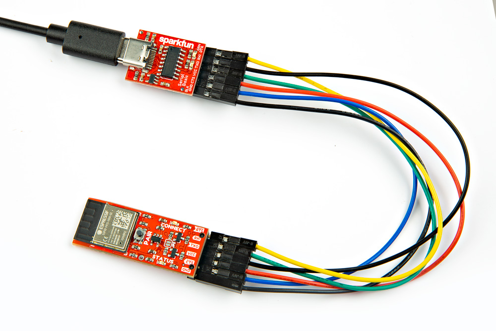
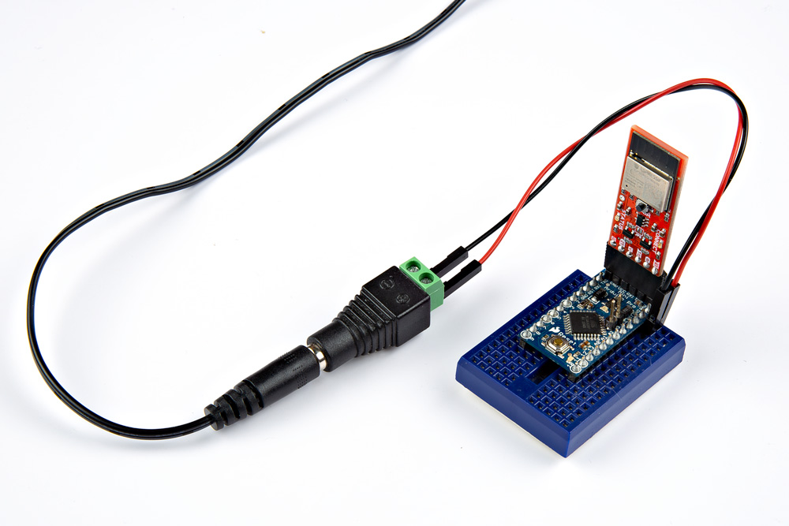

In this section, we'll go over how to connect to the BlueSMiRF v2.

### Connecting via BlueSMiRF v2 PTH

For a temporary connection to the PTH BlueSMiRF v2, you could use IC hooks to test out the pins. However, you'll need to solder headers or wires of your choice to the board for a secure connection. You can choose between a combination of [header pins and jumper wires](https://learn.sparkfun.com/tutorials/how-to-solder-through-hole-soldering/all), or [stripping wire and soldering the wire](https://learn.sparkfun.com/tutorials/working-with-wire/all) directly to the board.

-   <a href="https://learn.sparkfun.com/tutorials/how-to-solder-through-hole-soldering/all">
      <figure markdown>
        
      </figure>
    </a>

    ---

    <a href="https://learn.sparkfun.com/tutorials/how-to-solder-through-hole-soldering/all">
      <b>How to Solder: Through Hole Soldering</b>
    </a>
<!-- ----------WHITE SPACE BETWEEN GRID CARDS---------- -->

-   <a href="https://learn.sparkfun.com/tutorials/working-with-wire/all">
      <figure markdown>
        
      </figure>
    </a>

    ---

    <a href="https://learn.sparkfun.com/tutorials/working-with-wire/all">
      <b>Working with Wire</b>
    </a>
<!-- ----------WHITE SPACE BETWEEN GRID CARDS---------- -->

### Basic Serial UART Connection

At a minimum, you will need to connect serial TX, serial RX, power, and ground for a basic serial UART connection. This connection is needed to send serial data between the two UART devices, configure settings, or even manually upload binaries to the ESP32. Between each serial device, [always make sure to cross the RX and TX lines between serial devices (i.e. RX-to-TX and TX-to-RX)](https://learn.sparkfun.com/tutorials/serial-communication#common-pitfalls). The table indicates below shows color cells being the same for the TXO-to-RXI and RXI-to-TXO. Note that the order of the pins may be different depending on the design, so you may not be able to make a direct connection with the BlueSMiRF v2's 1x6 header.

    <table>
        <tr>
            <th style="text-align: center; border: solid 1px #cccccc;">Serial Device Pinout
            </th>
            <th style="text-align: center; border: solid 1px #cccccc;">BlueSMiRF v2 Pinout
            </th>
        </tr>
        <tr>        
            <td style="text-align: center; border: solid 1px #cccccc;" bgcolor="#d4edda">TXO
            </td>
            <td style="text-align: center; border: solid 1px #cccccc;" bgcolor="#d4edda">RXI
            </td>
        </tr>
        <tr>
            <td style="text-align: center; border: solid 1px #cccccc;" bgcolor="#ffdaaf">RXI
            <td style="text-align: center; border: solid 1px #cccccc;" bgcolor="#ffdaaf">TXO
            </td>
        </tr>
        <tr>
            <td style="text-align: center; border: solid 1px #cccccc;" bgcolor="#f2dede">3V3
            </td>
            <td style="text-align: center; border: solid 1px #cccccc;" bgcolor="#f2dede">VCC
            </td>
        </tr>
        <tr>
            <td style="text-align: center; border: solid 1px #cccccc;" bgcolor="#DDDDDD">GND
            </td>
            <td style="text-align: center; border: solid 1px #cccccc;" bgcolor="#DDDDDD">GND
            </td>
        </tr>
    </table>

!!! note
    In some cases, you may only need to just wire one serial wire from your serial device to the BlueSMiRF.

### USB-to-Serial Converter to BlueSMiRF v2

Depending on the USB-to-serial converter that you choose, you may need to install drivers. If you've never connected an FTDI or CH340 to your computer before, you may need to install drivers for the USB-to-serial converter. Check out our <a href="https://learn.sparkfun.com/tutorials/how-to-install-ftdi-drivers">How to Install FTDI Drivers</a> or <a href="https://learn.sparkfun.com/tutorials/sparkfun-serial-basic-ch340c-hookup-guide#drivers-if-you-need-them">How to Install CH340 Drivers</a> tutorial for help with the installation.

<!-- ----------WHITE SPACE BETWEEN GRID CARDS---------- -->
-   <a href="https://learn.sparkfun.com/tutorials/how-to-install-ftdi-drivers">
      <figure markdown>
        
      </figure>
    </a>

    ---

    <a href="https://learn.sparkfun.com/tutorials/how-to-install-ftdi-drivers">
      <b>How to Install FTDI Drivers</b>
    </a>
<!-- ----------WHITE SPACE BETWEEN GRID CARDS---------- -->
-   <a href="https://learn.sparkfun.com/tutorials/how-to-install-ch340-drivers">
      <figure markdown>
        
      </figure>
    </a>

    ---

    <a href="https://learn.sparkfun.com/tutorials/how-to-install-ch340-drivers">
      <b>How to Install CH340 Drivers</b>
    </a>
<!-- ----------WHITE SPACE BETWEEN GRID CARDS---------- -->

 To make a connection to a USB-to-serial converter, you will need a basic serial connection. There are several converters available such as the FT232 or CH340. Each of these boards include a different USB connector. You will need to manually wire them up using jumper wires as shown in the table and image below.

    <table>
        <tr>
            <th style="text-align: center; border: solid 1px #cccccc;">USB-to-Serial Converter Pinout
            </th>
            <th style="text-align: center; border: solid 1px #cccccc;" colspan="2">Intermediate Wire Connection</th>
            <th style="text-align: center; border: solid 1px #cccccc;">BlueSMiRF v2 Pinout
            </th>
        </tr>
        <tr>
            <td style="text-align: center; border: solid 1px #cccccc;" bgcolor="#fff3cd">DTR
            </td>
            <td style="text-align: center; border: solid 1px #cccccc;" bgcolor="#fff3cd">
            <td style="text-align: center; border: solid 1px #cccccc;" bgcolor="#fff3cd">
            <td style="text-align: center; border: solid 1px #cccccc;" bgcolor="#fff3cd">RTS
            </td>
        </tr>
        <tr>        
            <td style="text-align: center; border: solid 1px #cccccc;" bgcolor="#ffdaaf">RXI
            </td>
            <td style="text-align: center; border: solid 1px #cccccc;" bgcolor="#ffdaaf">
            </td>
            <td style="text-align: center; border: solid 1px #cccccc;" bgcolor="#d4edda">
            </td>
            <td style="text-align: center; border: solid 1px #cccccc;" bgcolor="#d4edda">RXI
            </td>
        </tr>
        <tr>        
            <td style="text-align: center; border: solid 1px #cccccc;" bgcolor="#d4edda">TXO
            </td>
            <td style="text-align: center; border: solid 1px #cccccc;" bgcolor="#d4edda">
            </td>
            <td style="text-align: center; border: solid 1px #cccccc;" bgcolor="#ffdaaf">
            </td>
            <td style="text-align: center; border: solid 1px #cccccc;" bgcolor="#ffdaaf">TXO
            </td>
        </tr>
        <tr>
            <td style="text-align: center; border: solid 1px #cccccc;" bgcolor="#f2dede">3V3
            </td>
            <td style="text-align: center; border: solid 1px #cccccc;" bgcolor="#f2dede">
            </td>
            <td style="text-align: center; border: solid 1px #cccccc;" bgcolor="#f2dede">
            </td>
            <td style="text-align: center; border: solid 1px #cccccc;" bgcolor="#f2dede">VCC
            </td>
        </tr>
        <tr>
            <td style="text-align: center; border: solid 1px #cccccc;" bgcolor="#cce5ff">CTS
            </td>
            <td style="text-align: center; border: solid 1px #cccccc;" bgcolor="#cce5ff">
            </td>
            <td style="text-align: center; border: solid 1px #cccccc;" bgcolor="#cce5ff">
            </td>
            <td style="text-align: center; border: solid 1px #cccccc;" bgcolor="#cce5ff">CTS
            </td>
        </tr>
        <tr>
            <td style="text-align: center; border: solid 1px #cccccc;" bgcolor="#DDDDDD">GND
            </td>
            <td style="text-align: center; border: solid 1px #cccccc;" bgcolor="#DDDDDD">
            </td>
            <td style="text-align: center; border: solid 1px #cccccc;" bgcolor="#DDDDDD">
            </td>
            <td style="text-align: center; border: solid 1px #cccccc;" bgcolor="#DDDDDD">GND
            </td>
        </tr>
    </table>

!!! note
    The connection also includes two additional connection for flow control: RTS and CTS. These two connections are not needed for a basic serial UART connection. However, using all six wires can help make a tighter connection on the 1x6 header. The wire colors also connect TXO-to-RXI and RXI-to-TXO to indicate that it is not a direct connection between the two boards and the 1x6 header.

Below is one example between the serial basic breakout (CH340, USB-C) and the BlueSMiRF v2 Header. Male to female jumper wires were connected between the boards.

  <table>
    <tr style="vertical-align:middle;">
     <td style="text-align: center; vertical-align: middle;"></td>
    </tr>
    <tr style="vertical-align:middle;">
     <td style="text-align: center; vertical-align: middle;"><i>USB-to-Serial Converter (CH340) to BlueSMiRF v2 Header with TX-to-RX and RX-to-TX</i>
     </td>
    </tr>
  </table>

Adding a simple 1x6 stackable header between the jumper wires will make a quick adapter with the M/F jumper wires and USB-to-serial converter. You'll just need to match the DTR and GND pins. This is useful for those that need to constantly configure the BlueSMiRF V2's settings and re-reconnect to a USB-to-serial converter.

  <table>
    <tr style="vertical-align:middle;">
     <td style="text-align: center; vertical-align: middle;"></td>
    </tr>
    <tr style="vertical-align:middle;">
     <td style="text-align: center; vertical-align: middle;"><i>USB-to-Serial Converter (CH340) to BlueSMiRF v2 Header with an Additional Stackable Header</i>
     </td>
    </tr>
  </table>

!!! tip
    To make it easier to connect visually, try adding a polarity marker with whiteout, Sharpie, or paint. You can even try rotating one of the jumper wires so that the metal tabs is not facing the same direction on one or both ends.

Remember, for those that are using the PTH version, you will need to solder either male headers, female headers, or wires. The type of header or wire will depend on your personal preference and project needs. In this case, we used a 1x6 female header to the board. At the time of writing, there were only female to male jumper wires available so extra long headers were placed between the female header pins. The male header was connected to another serial basic (CH340).

  <table>
    <tr style="vertical-align:middle;">
     <td style="text-align: center; vertical-align: middle;"></td>
    </tr>
    <tr style="vertical-align:middle;">
     <td style="text-align: center; vertical-align: middle;"><i>USB-to-Serial Converter (CH340) to BlueSMiRF v2 PTH</i>
     </td>
    </tr>
  </table>

### BlueSMiRF v2 to Standard Serial UART Port

For boards that already include the footprint for a standard serial UART port, you can connect directly to the pins. You will find these on a few Arduino development boards. The Arduino Pro, Arduino Pro Mini, and LilyPad Arduino 328 Main Board are just a few boards that have the standard port. You will also notice certain boards will have the standard serial UART port labeled as the RTCM Correction Port on SparkFun high precision GNSS breakout boards. For certain boards that have a male header soldered, you may need to consider soldering a 1x6 female header on the BlueSMiRF V2 PTH.

  <table>
    <tr style="vertical-align:middle;">
      <td style="text-align: center; vertical-align: middle;"></td>
      <td style="text-align: center; vertical-align: middle;"></td>
      <td style="text-align: center; vertical-align: middle;"></td>
    </tr>
    <tr style="vertical-align:middle;">
     <td style="text-align: center; vertical-align: middle;"><i>BlueSMiRF v2 Replacing Serial Connection on the Arduino Pro Mini 3.3V Serial Header Port</i>
     </td>
     <td style="text-align: center; vertical-align: middle;"><i>BlueSMiRF V2 Connected to the ZED-F9P's RTCM Correction Port</i>
     </td>
     <td style="text-align: center; vertical-align: middle;"><i>UM980 with the BlueSMiRF V2 Connected to the UM980's RTCM Correction Port</i>
     </td>

    </tr>
  </table>

