In this section, we will highlight the hardware and pins that are broken out on the SparkFun BlueSMiRF v2. For the scope of the tutorial, we will be referring to the version with the headers.

  <table>
    <tr style="vertical-align:middle;">
     <td style="text-align: center; vertical-align: middle; border: solid 1px #cccccc;""></td>
     <td style="text-align: center; vertical-align: middle; border: solid 1px #cccccc;""></td>
    </tr>
    <tr style="vertical-align:middle;">
     <td style="text-align: center; vertical-align: middle; border: solid 1px #cccccc;"><i>SMD with Headers, Top View</i></td>
     <td style="text-align: center; vertical-align: middle; border: solid 1px #cccccc;"><i>SMD with Headers, Bottom View</i></td>
    </tr>
  </table>

There is also a version with PTHs out in the wild and it is essentially the same. The only differences are that the pins are broken out to PTHs instead of a SMD right angle male header and the silkscreen labels.

  <table>
    <tr style="vertical-align:middle;">
     <td style="text-align: center; vertical-align: middle; border: solid 1px #cccccc;""></td>
     <td style="text-align: center; vertical-align: middle; border: solid 1px #cccccc;""><a href="../assets/img/24113-BlueSMiRF-v2_PTH_NoHeaders_bottom.jpg">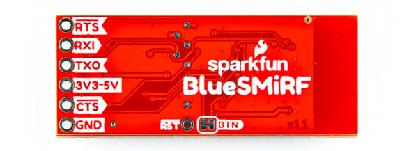</a></td>
    </tr>
    <tr style="vertical-align:middle;">
     <td style="text-align: center; vertical-align: middle; border: solid 1px #cccccc;"><i>PTH Version, Top View</i></td>
     <td style="text-align: center; vertical-align: middle; border: solid 1px #cccccc;"><i>PTH Version, Bottom View</i></td>
    </tr>
  </table>

 For more information, check out our [Resources and Going Further](../resources/) for the board designs and the ESP32.

### ESP32-PICO-MINI-02

The board includes the smaller ESP32-PICO-MINI-02 module from Espressif. The SparkFun BlueSMiRF v2 is perfect for short range applications that require point-to-point communication. We've written some firmware to allow serial UART data to be sent between two Bluetooth devices. The supported protocols include SPP and BLE. Testing a pair of BlueSMiRF V2s and we got about ~110 feet (~33m) in the SparkFun building. The TX (10k) and RX (50k) buffers are also very large to allow for radio delays. The included firmware also includes a set of AT commands to configure the ESP32. This includes the baud rate, flow control, LED mode, and Over-The-Air (OTA) updates over a 2.4GHz WiFi network to name a few. You can also manually reprogram the ESP32 module using the command line interface as well! Just make sure to connect Tx and Rx between the BlueSMiRF and a USB-to-serial converter.

  <table>
    <tr style="vertical-align:middle;">
     <td style="text-align: center; vertical-align: middle;"></td>
    </tr>
  </table>

### Power

Power is broken out on the 1x6 header through the VCC and GND pins. The recommended input voltage can be between **3.3V** to **5V**. Logic level shifting circuitry is included on the TX and RX pins so that they are 3.3V to 5V tolerant.

* **VCC** / **3V3-5V** &mdash; On the top of the board, the input voltage is labeled as **VCC**. On the back of the board, this is labeled as **3V3-5V**. Voltage is regulated down with the AP2112K 3.3V/600mA voltage regulator from this pin. Typically, one would apply either 3.3V or 5V to this pin. Make sure that power you provide to this pin does not exceed *6 volts*. For advanced users, you can bypass this voltage regulator by adding a solder blob on the jumper labeled as **JP2**. Be careful as the input voltage range is smaller and you may run the risk of damaging the ESP32.
* **GND** &mdash; Of course, is the common, ground voltage (0V reference) for the system.

  <table>
    <tr style="vertical-align:middle;">
     <td style="text-align: center; vertical-align: middle; border: solid 1px #cccccc;""><a href="../assets/img/23287-BlueSMiRF-v2-WithHeaders_Power_Top.jpg">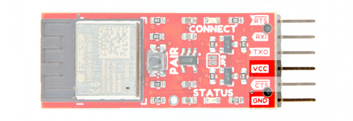</a></td>
     <td style="text-align: center; vertical-align: middle; border: solid 1px #cccccc;""><a href="../assets/img/23287-BlueSMiRF-v2-WithHeaders_Power_Bottom.jpg">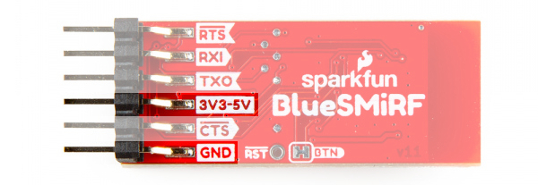</a></td>
    </tr>
    <tr style="vertical-align:middle;">
     <td style="text-align: center; vertical-align: middle; border: solid 1px #cccccc;"><i>Power, Top View</i></td>
     <td style="text-align: center; vertical-align: middle; border: solid 1px #cccccc;"><i>Power, Bottom View</i></td>
    </tr>
  </table>

The current and power consumption depends on what it's doing at the time. Here are some of our results after measuring the current and power consumption at 3.3V. The module can get toasty when pushing serial traffic through but not scary-burn-you-hot.

* Idle: 72mA / 238mW
* Connected with no Serial Traffic: 75mA / 248mW
* Constant Duplex Serial Traffic: 140mA / 462mW

!!! note
    There are also test points on the back of the board that are not labeled for VCC and GND. These are not labeled and are used by SparkFun's production for testing & programming the board using test beds.

### Reset

The reset PTH labeled as RST will restart the ESP32 whenever the pin is grounded.

  <table>
    <tr style="vertical-align:middle;">
     <td style="text-align: center; vertical-align: middle; border: solid 1px #cccccc;""></td>
     <td style="text-align: center; vertical-align: middle; border: solid 1px #cccccc;""><a href="../assets/img/23287-BlueSMiRF-v2-WithHeaders_Reset_Bottom.jpg">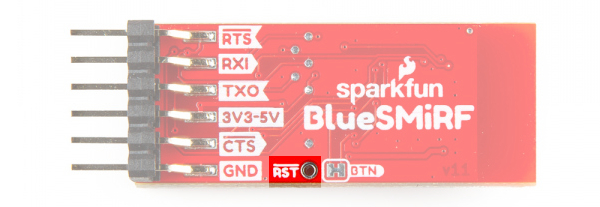</a></td>
    </tr>
    <tr style="vertical-align:middle;">
     <td style="text-align: center; vertical-align: middle; border: solid 1px #cccccc;"><i>Reset, Top View</i></td>
     <td style="text-align: center; vertical-align: middle; border: solid 1px #cccccc;"><i>Reset, Bottom View</i></td>
    </tr>
  </table>

### Serial UART Port

!!! note
    As stated in the [previous section](../old_school_to_new_school), the pinout of the BlueSMiRF v2 is different from previous BlueSMiRFs, hence the version 2. Besides the ESP32 module, the pinout has the same pinout as previous Bluetooth Mates and USB-to-serial converters (i.e. FTDI, CH340, etc.). The board is meant to connect directly with an Arduino Pro, Pro Mini, RTCM Correction Ports on high precision GNSS breakout boards, or any board with a standard serial-to-USB port. Below is the back of the Bluetooth Mate, BlueSMiRF, and BlueSMiRF v2 boards.

    

      <table>
        <tr style="vertical-align:middle;">
         <td style="text-align: center; vertical-align: middle; border: solid 1px #cccccc;><a href="../assets/img/Header_BlueSMiRF_Bluetooth_Mate_Comparison_2.jpg">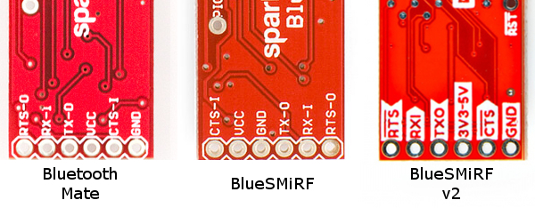</a></td>
        </tr>
        <tr style="vertical-align:middle;">
         <td style="text-align: center; vertical-align: middle; border: solid 1px #cccccc;"><i>Back of Bluetooth Mate, BlueSMiRF, and BlueSMiRF v2</i></td>
        </tr>
      </table>
    

Both boards include a standard serial UART header seen on many USB-to-serial converters: RTS/RXI/TXO/VCC/CTS/GND . Depending on the version that you receive, one will be PTH while the other is includes right angle male headers. Due to spacing, the PTH version will also have a different silkscreen labels.

* <b>RTS</b> / <b>RT</b> &mdash; The Return to Send is an output and is used for hardware flow control in some serial interfaces. Unlike Tx and RX, this pin does not include logic level translation. This output is not critical for simple serial communication.
* **RXI** / **RI** &mdash; The serial receive is an input. This input pin receives serial data from another serial device. Logic level circuitry is included on this pin. **It should be connected to the TX of the other device.**
* **TXO** / **TO** &mdash;	The serial transmit is an output. This output pin sends serial data to another device. Logic level circuitry is included on this pin. **It should be connected to the RX of the other device.**
* **VCC**/ **V** / **3V3-5V** &mdash; This input voltage supply signal is routed through a AP2112K voltage regulator and brought down 3.3V for the ESP32. We will assume that it is attached to another device's standard serial port and it is providing power to the BlueSMiRF v2. As stated earlier, the recommended input voltage is between **3.3V to 5V**.
* <b>CTS</b> / <b>CT</b> &mdash; The Clear to Send is an input. CTS is another serial flow control signal. Unlike Tx and RX, this pin does not include logic level translation. Like RTS, it's not required for most, simple serial interfaces.
* **GND** / **G** &mdash; The 0V reference voltage, common to any other device connected to the Bluetooth modem.

  <table>
    <tr style="vertical-align:middle;">
     <td style="text-align: center; vertical-align: middle; border: solid 1px #cccccc;""><a href="../assets/img/23287-BlueSMiRF-v2-WithHeaders_Serial_UART_Header_Top.jpg">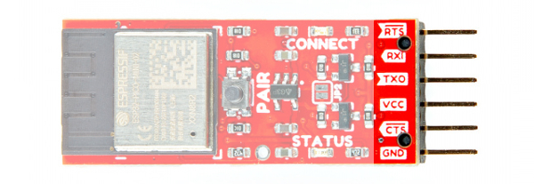</a></td>
     <td style="text-align: center; vertical-align: middle; border: solid 1px #cccccc;""></td>
    </tr>
    <tr style="vertical-align:middle;">
     <td style="text-align: center; vertical-align: middle; border: solid 1px #cccccc;"><i>Serial Header, Top View</i></td>
     <td style="text-align: center; vertical-align: middle; border: solid 1px #cccccc;"><i>Serial Header, Bottom View</i></td>
    </tr>
  </table>

  <table>
    <tr style="vertical-align:middle;">
     <td style="text-align: center; vertical-align: middle; border: solid 1px #cccccc;""></td>
     <td style="text-align: center; vertical-align: middle; border: solid 1px #cccccc;""></td>
    </tr>
    <tr style="vertical-align:middle;">
     <td style="text-align: center; vertical-align: middle; border: solid 1px #cccccc;"><i>PTH Serial Header, Top View</i></td>
     <td style="text-align: center; vertical-align: middle; border: solid 1px #cccccc;"><i>PTH Serial Header, Bottom View</i></td>
    </tr>
  </table>

!!! tip
    For those that are connecting to the old school RS232 serial port, you will need a [RS232 to TTL converter](https://www.sparkfun.com/products/449) for higher voltages. The RS232 to TTL converter can handle larger voltages designed for RS232.

    

      <table>
        <tr style="vertical-align:middle;">
         <td style="text-align: center; vertical-align: middle; border: solid 1px #cccccc;"></td>
        </tr>
        <tr style="vertical-align:middle;">
         <td style="text-align: left; vertical-align: middle; border: solid 1px #cccccc;"><a href="https://www.sparkfun.com/products/449"><b>SparkFun RS232 Shifter - SMD</b>
          
         PRT-00449</a></td>
        </tr>
      </table>
    

!!! warning
    While the TX and RX pins have logic level circuitry, the CTS and RTS do not. Make sure to be careful when connecting the flow control pins to a 5V system.

### Button

The PAIR button is more than meets the eye. This button has more than one function depending on how long it is pushed down.

* **Short Push** &mdash; Press and hold the button down between **4 to 8 seconds** will initiate pairing with another Bluetooth device. During that period of time, the **Status** and **Connect** LEDs will slowly blink back and forth. When the BlueSMiRF V2 fails to discover any compatible devices, it will enter _Discoverable_ mode.
* **Long Push** &mdash; Press and hold the down for **more than 8 seconds**  to set the ESP32 back to its factory default settings.

  <table>
    <tr style="vertical-align:middle;">
     <td style="text-align: center; vertical-align: middle;"><a href="../assets/img/23287-BlueSMiRF-v2-WithHeaders_Button.jpg">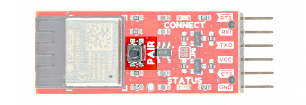</a></td>
    </tr>
  </table>

!!! note
    Users can also set the BlueSMiRF v2 in bootloader mode. In this mode, you can update the firmware manually through serial using a command line interface. Users will need to hold down the PAIR button when the BlueSMiRF v2 is not powered. Applying power will set the microcontroller to bootloader mode.

For more information about using the button for each mode, check out the section about the [button control](../button/).

<a href="../button/" class="md-button">Button Control</a>

### LEDs

The board includes the following status LEDs as indicated in the image below.

* **CONNECT** &mdash; The connect LED indicates when the ESP32 is connected to another Bluetooth device. The behavior of the LED will depend on the mode:
    * `0` &mdash; By default, the CONNECT LED will blink until it is connect to another Bluetooth device. Once connected, this LED will remain solid.
    * `1` &mdash; When set to a `1`, the CONNECT LED will blink until it is connected to another Bluetooth device. Once connected, this LED will blink with TX traffic.
* **STATUS** &mdash; The status LED indicates when there is UART traffic. The behavior of the LED will depend on the mode.
    * `0` &mdash; By default, the STATUS LED blinks with any TX/RX traffic.
    * `1` &mdash; When set to a `1`, the STATUS LED blinks with only the RX traffic.

  <table>
    <tr style="vertical-align:middle;">
     <td style="text-align: center; vertical-align: middle;"><a href="../assets/img/23287-BlueSMiRF-v2-WithHeaders_LEDs.jpg">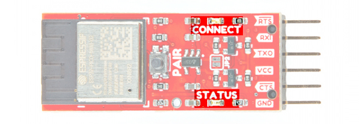</a></td>
    </tr>
  </table>

The LEDs can also blink at different rates, fade, or become dim when the PAIR button is held down. This is used as an indicator to tell when we are entering pairing, factory reset, or bootloader mode. For more information, check out the section about the [button control](../button/).

<a href="../button/" class="md-button">Button Control</a>

### Jumpers

!!!note
    If this is your first time working with jumpers, check out the [How to Work with Jumper Pads and PCB Traces](https://learn.sparkfun.com/tutorials/how-to-work-with-jumper-pads-and-pcb-traces/all) tutorial for more information.

The board includes the following jumpers on the top and bottom of the board.

* **JP2** &mdash; Jumper pad 2 is open by default. This jumper is used to bypass the 3.3V voltage regulator. Add a solder blob to close the jumper to connect VCC to 3.3V.
* **BTN** &mdash; The button jumper are closed by default. This connects the pair button to GPIO pin 0. Cut this jumper to disable the button.

  <table>
    <tr style="vertical-align:middle;">
     <td style="text-align: center; vertical-align: middle; border: solid 1px #cccccc;""><a href="../assets/img/23287-BlueSMiRF-v2-WithHeaders_JP2_VCC_Bypass_Jumper.jpg">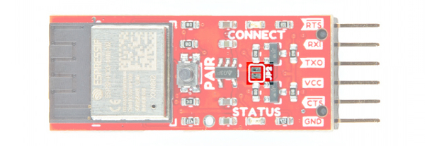</a></td>
     <td style="text-align: center; vertical-align: middle; border: solid 1px #cccccc;""><a href="../assets/img/23287-BlueSMiRF-v2-WithHeaders_Button_BTN_Jumper.jpg">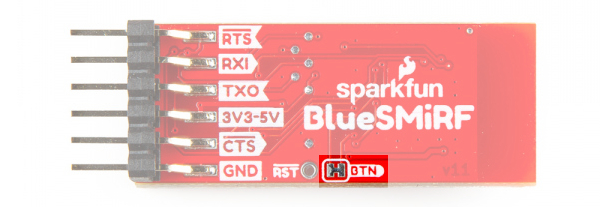</a></td>
    </tr>
    <tr style="vertical-align:middle;">
     <td style="text-align: center; vertical-align: middle; border: solid 1px #cccccc;"><i>Jumpers, Top View</i></td>
     <td style="text-align: center; vertical-align: middle; border: solid 1px #cccccc;"><i>Jumpers, Bottom View</i></td>
    </tr>
  </table>

### Board Dimensions

Each version of the board is 38.1mm x 15.2mm. Note that the version with the headers makes the board slightly longer by making the overall length 44.2mm. Adding a row of female 1x6 headers or jumper wires will increase the length slightly as well. There are no mounting holes for standoffs on the boards.

  <table>
    <tr style="vertical-align:middle;">
     <td style="text-align: center; vertical-align: middle; border: solid 1px #cccccc;""></td>
     <td style="text-align: center; vertical-align: middle; border: solid 1px #cccccc;""><a href="../assets/img/SparkFun_BlueSMiRF-v2_SMD_Headers_Board_Dimensions.jpg">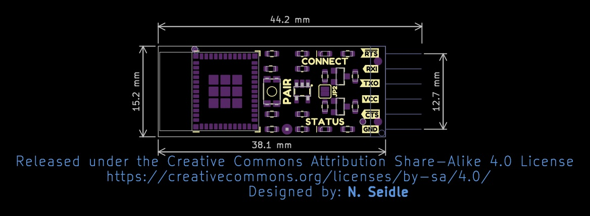</a></td>
    </tr>
    <tr style="vertical-align:middle;">
     <td style="text-align: center; vertical-align: middle; border: solid 1px #cccccc;"><i>Board Dimensions for PTH, without Headers</i></td>
     <td style="text-align: center; vertical-align: middle; border: solid 1px #cccccc;"><i>Board Dimensions for SMD with Headers</i></td>
    </tr>
  </table>

