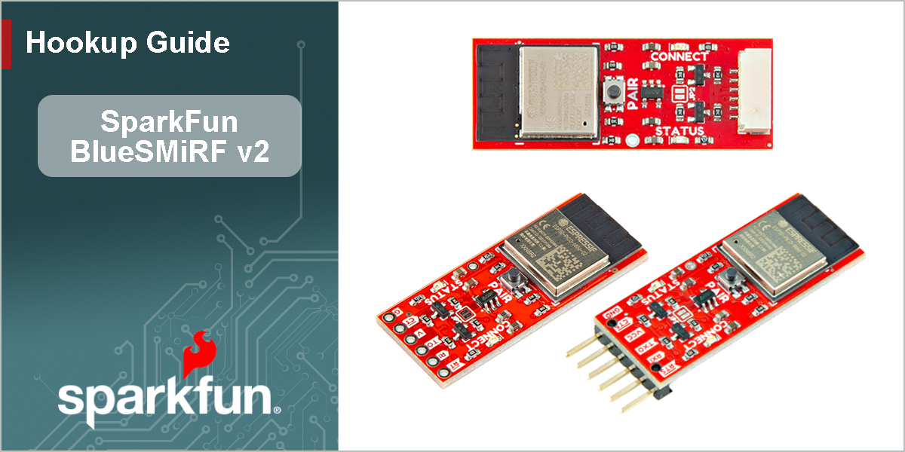

<article style="text-align: center;" markdown>
{ width="650px" }
</article>

# Introduction

<article class="video-container" style="margin: auto;" markdown>
<iframe width="560" height="315" src="https://www.youtube.com/embed/i8u3W0jVFTw?si=9iwrsCm9Ih9n9VCz" title="Product Showcase: SparkFun BlueSMiRF v2" frameborder="0" allow="accelerometer; autoplay; clipboard-write; encrypted-media; gyroscope; picture-in-picture" allowfullscreen></iframe>
</article>

-   Our BlueSMiRF product line is a series of wireless Bluetooth&reg; serial links. The SparkFun BlueSMiRF v2 is a reboot of the previous [BlueSMiRF board](https://www.sparkfun.com/sparkfun-bluetooth-mate-silver.html), utilizing the Espressif's ESP32 Pico Mini for wireless communication and comes in several variants, with [PTH pins](https://www.sparkfun.com/sparkfun-bluesmirf-v2.html), [male headers](https://www.sparkfun.com/sparkfun-bluesmirf-v2-headers.html), or a [JST connector](https://www.sparkfun.com/sparkfun-bluesmirf-v2-jst.html). These boards operate as a serial data link and are a great replacement for hardwired between boards. Simply connect a BlueSMiRF v2, pair the devices over Bluetooth&reg;, and simultaneously transmit and receive data! Any serial stream from 2400 to 921600 baud can be passed between two devices; with a range of 100' (33m). In this tutorial, we'll go over the hardware and the connections to a BlueSMiRF v2. We will also provide a few examples; including, how to connect to the BlueSMiRF v2 with a smartphone and a basic Arduino example transmitting data between two BlueSMiRF v2s... so [let's get started!](hardware_overview.md)

-   <a href="https://www.sparkfun.com/sparkfun-bluesmirf-v2.html">
	**SparkFun BlueSMiRF v2 - PTH Pins** 
	**SKU:** WRL-24113

	---

	<figure markdown>
	
	</figure></a>

	<article style="text-align: center;" markdown>
	[Purchase from SparkFun :fontawesome-solid-cart-plus:](https://www.sparkfun.com/sparkfun-bluesmirf-v2.html){ .md-button .md-button--primary }
	</article>

-   <a href="https://www.sparkfun.com/sparkfun-bluesmirf-v2-headers.html">
	**SparkFun BlueSMiRF v2 - Male Header** 
	**SKU:** WRL-23287

	---

	<figure markdown>
	
	</figure></a>

	<article style="text-align: center;" markdown>
	[Purchase from SparkFun :fontawesome-solid-cart-plus:](https://www.sparkfun.com/sparkfun-bluesmirf-v2-headers.html){ .md-button .md-button--primary }
	</article>

-   <a href="https://www.sparkfun.com/sparkfun-bluesmirf-v2-jst.html">
	**SparkFun BlueSMiRF v2 - JST Connector** 
	**SKU:** WRL-30414

	---

	<figure markdown>
	
	</figure></a>

	<article style="text-align: center;" markdown>
	[Purchase from SparkFun :fontawesome-solid-cart-plus:](https://www.sparkfun.com/sparkfun-bluesmirf-v2-jst.html){ .md-button .md-button--primary }
	</article>

## Required Materials
To follow along with the examples in this tutorial, you will need the following materials. You may not need everything though depending on what you have. Add it to your cart, read through the guide, and adjust the cart as necessary. We recommend the board with headers to minimize the amount of soldering to your application.

- 2x [SparkFun BlueSMiRF v2 - Headers](https://www.sparkfun.com/sparkfun-bluesmirf-v2-headers.html)
- 2x [Jumper Wires Premium 6" M/F Pack of 10](https://https://www.sparkfun.com/jumper-wires-premium-6-m-f-pack-of-10.html)
- 2x [SparkFun Serial Basic Breakout - CH340C and USB-C](https://www.sparkfun.com/sparkfun-serial-basic-breakout-ch340c-and-usb-c.html)
- 2x [USB-A to USB-C Cable - 1m, USB 2.0 (Flexible Silicone)](https://www.sparkfun.com/usb-a-to-usb-c-cable-1m-usb-2-0-flexible-silicone.html)

-   <a href="https://www.sparkfun.com/sparkfun-bluesmirf-v2-headers.html">
	<figure markdown>
	
	</figure>

	---

	**SparkFun BlueSMiRF v2 - Headers**

	WRL-23287
	</a>

-   <a href="https://https://www.sparkfun.com/jumper-wires-premium-6-m-f-pack-of-10.html">
	<figure markdown>
	
	</figure>

	---

	**Jumper Wires Premium 6" M/F Pack of 10**

	PRT-09140
	</a>

-   <a href="https://www.sparkfun.com/sparkfun-serial-basic-breakout-ch340c-and-usb-c.html">
	<figure markdown>
	
	</figure>

	---

	**SparkFun Serial Basic Breakout - CH340C and USB-C**

	DEV-15096
	</a>

-   <a href="https://www.sparkfun.com/usb-a-to-usb-c-cable-1m-usb-2-0-flexible-silicone.html">
	<figure markdown>
	
	</figure>

	---

	**USB-A to USB-C Cable - 1m, USB 2.0 (Flexible Silicone)**

	CAB-25630
	</a>

### Tools *(Optional)*

You will need a soldering iron, solder, and [general soldering accessories](https://www.sparkfun.com/categories/49) for a secure connection when using the plated through holes. You may also need to solder headers or wires to any devices that the BlueSMiRF v2 is connecting to.

- [Soldering Iron [TOL-14456]](https://www.sparkfun.com/products/14456)
- [Solder Lead Free - 15-gram Tube [TOL-9163]](https://www.sparkfun.com/products/9163)
- [Flush Cutters - Xcelite [TOL-14782]](https://www.sparkfun.com/products/14782)
- [Hook-Up Wire - Assortment (Stranded, 22 AWG) [PRT-11375]](https://www.sparkfun.com/products/11375)
- [Wire Strippers - 20-30 AWG [TOL-24771]](https://www.sparkfun.com/products/24771)

-   <a href="https://www.sparkfun.com/products/14456">
	<figure markdown>
	
	Soldering Iron - 60W (Adjustable Temperature)">
	</figure>

	---

	**Soldering Iron - 60W (Adjustable Temperature)**

	TOL-14456
	</a>

-   <a href="https://www.sparkfun.com/products/9163">
	<figure markdown>
	
	Solder Lead Free - 15-gram Tube">
	</figure>

	---

	<a href="https://www.sparkfun.com/products/9163">
	**Solder Lead Free - 15-gram Tube**

	TOL-09163
	</a>

-   <a href="https://www.sparkfun.com/products/11375">
	<figure markdown>
	
	Hook-Up Wire - Assortment (Stranded, 22 AWG)">
	</figure>

	---

	<a href="https://www.sparkfun.com/products/11375">
	**Hook-Up Wire - Assortment (Stranded, 22 AWG)**

	PRT-11375
	</a>

-   <a href="https://www.sparkfun.com/products/24771">
	<figure markdown>
	
	Wire Strippers - 20-30 AWG">
	</figure>

	---

	<a href="https://www.sparkfun.com/products/24771">
	**Wire Strippers - 20-30 AWG**

	TOL-24771
	</a>

-   <a href="https://www.sparkfun.com/products/14782">
	<figure markdown>
	
	Flush Cutters - Xcelite">
	</figure>

	---

	<a href="https://www.sparkfun.com/products/14782">
	**Flush Cutters - Xcelite**

	TOL-14782
	</a>

### Prototyping Accessories *(Optional)*

For those using the PTH version, you will need to connect to the PTHs. You could use IC hooks and a breadboard for a temporary connection depending on your setup and what you have available. Of course, you will want to the solder header pins for a secure connection. We'll assume that you will want to solder a female header since there is already a BlueSMiRF v2 with the male headers available. Then again, you can still solder wire or even your own male headers if you prefer. Below are a few prototyping accessories that you may want to consider.

* [Breadboard - Self-Adhesive (White) [PRT-12002]](https://www.sparkfun.com/products/12002)
* [IC Hook with Pigtail [CAB-09741]](https://www.sparkfun.com/products/9741)
* [Header - 6-pin Female (PTH, 0.1") [PRT-11894]](https://www.sparkfun.com/products/11894)
* [Arduino Stackable Header - 6 Pin [PRT-09280]](https://www.sparkfun.com/products/9280)
* [Break Away Headers - Straight [PRT-00116]](https://www.sparkfun.com/products/116)
* [Break Away Headers - 40-pin Male (Long Centered, PTH, 0.1") [PRT-12693]](https://www.sparkfun.com/products/12693)
* [Jumper Wires Premium 6" M/F Pack of 10 [PRT-09140]](https://www.sparkfun.com/products/9140)
* [Jumper Wires Premium 6" F/F Pack of 10 [PRT-08430]](https://www.sparkfun.com/products/8430)

-   <a href="https://www.sparkfun.com/products/12002">
	<figure markdown>
	
	</figure>

	---

	**Breadboard - Self-Adhesive (White)**

	PRT-12002
	</a>

-   <a href="https://www.sparkfun.com/products/9741">
	<figure markdown>
	
	</figure>

	---

	**IC Hook with Pigtail**

	CAB-09741
	</a>

-   <a href="https://www.sparkfun.com/products/11894">
	<figure markdown>
	
	</figure>

	---

	**Female Headers**

	PRT-11894
	</a>

-   <a href="https://www.sparkfun.com/products/9280">
	<figure markdown>
	
	</figure>

	---

	**Arduino Stackable Header - 6 Pin**

	PRT-09280
	</a>

-   <a href="https://www.sparkfun.com/products/116">
	<figure markdown>
	
	</figure>

	---

	**Break Away Headers - Straight**

	PRT-00116
	</a>

-   <a href="https://www.sparkfun.com/products/12693">
	<figure markdown>
	
	</figure>

	---

	**Break Away Headers - 40-pin Male (Long Centered, PTH, 0.1")**

	PRT-12693
	</a>

-   <a href="https://www.sparkfun.com/products/9140">
	<figure markdown>
	
	</figure>

	---

	**Jumper Wires Premium 6" M/F Pack of 10**

	PRT-09140
	</a>

-   <a href="https://www.sparkfun.com/products/8431">
	<figure markdown>
	
	</figure>

	---

	**Jumper Wires Premium 6" M/M Pack of 10**

	PRT-08431
	</a>

-   <a href="https://www.sparkfun.com/products/553">
	<figure markdown>
	
	</figure>

	---

	**Break Away Male Headers - Right Angle**

	PRT-00553
	</a>

### You Will Also Need
Depending on your setup or what you are doing, you may need the following as well.

- 2.4GHz WiFi Network for firmware updates
- Smartphone with an Internet Service

## Suggested Reading
If you aren’t familiar with the following concepts, we also recommend checking out a few of these tutorials before continuing.

-   <a href="https://learn.sparkfun.com/tutorials/bluetooth-basics">
	<figure markdown>
	
	</figure>

	---

	**Bluetooth Basics**
	</a>

-   <a href="https://learn.sparkfun.com/tutorials/terminal-basics">
	<figure markdown>
	
	</figure>

	---

	**Serial Terminal Basics**
	</a>

-   <a href="https://learn.sparkfun.com/tutorials/serial-communication">
	<figure markdown>
	
	</figure>

	---

	**Serial Communication**
	</a>

-   <a href="https://learn.sparkfun.com/tutorials/how-to-solder-through-hole-soldering">
	<figure markdown>
	
	</figure>

	---

	**How to Solder: Through-Hole Soldering**
	</a>

-   <a href="https://learn.sparkfun.com/tutorials/logic-levels">
	<figure markdown>
	
	</figure>

	---

	**Logic Levels**
	</a>

