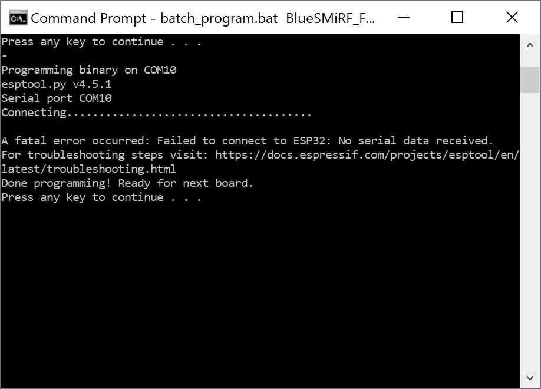

### General Troubleshooting Help

!!! note
    
        <strong> Not working as expected and need help? </strong>   

    If you need technical assistance and more information on a product that is not working as you expected, we recommend heading on over to the <a href="https://www.sparkfun.com/technical_assistance">SparkFun Technical Assistance</a> page for some initial troubleshooting.   

    
<a href="https://www.sparkfun.com/technical_assistance" target="sfe_technical_assistance" class="md-button">SparkFun Technical Assistance Page</a>

    If you don't find what you need there, the <a href="https://forum.sparkfun.com/">SparkFun Forums</a> are a great place to find and ask for help. If this is your first visit, you'll need to <a href="https://forum.sparkfun.com/ucp.php?mode=register">create a Forum Account</a> to search product forums and post questions.  

    
<a href="https://forum.sparkfun.com/ucp.php?mode=register" class="md-button">Create New Forum Account</a>&nbsp;&nbsp;&nbsp;<a href="https://forum.sparkfun.com/viewforum.php?f=180" class="md-button md-button--primary">Log Into SparkFun Forums</a>

### Issues Uploading Code Manually via CLI

If you are seeing the following error when attempting to flash the binaries:

<pre>
    <code class="language-bash" style="white-space: pre-wrap;">A fatal error occurred: Failed to connect to ESP32: No serial data received. For troubleshooting steps visit: https://docs.espressif.com/projects/esptool/en/latest/troubleshooting.md_in_html
Done programming! Ready for next board.
Press any key to continue . . .
    </code>
</pre>

  <table>
    <tr style="vertical-align:middle;">
     <td style="text-align: center; vertical-align: middle;"></td>
    </tr>
    <tr style="vertical-align:middle;">
     <td style="text-align: center; vertical-align: middle;"><i>Error Programming BlueSMiRF V2 - ESP32</i></td>
    </tr>
  </table>

Make sure to:

* ensure that the wires are making connection and not loose
* wired correctly between the USB-to-Serial Converter and your BlueSMiRF V2
* COM Port is the same one that the USB-to-Serial converter enumerated to on your computer
* install the appropriate drivers
* in Bootloader Mode

Still having issues? Try a power cycle by following the steps below:

* disconnecting the USB-to-serial converter from your computer
* pushing down on the pair button for bootloader mode
* connecting the USB-to-serial converter back to your computer

### Can the BlueSMiRF v2 be used for wireless serial upload with an Arduino?

Currently, there is not support for wireless serial upload with an Arduino. We recommend removing the BlueSMiRF v2 and using a USB-to-serial converter to upload code to an Arduino.
