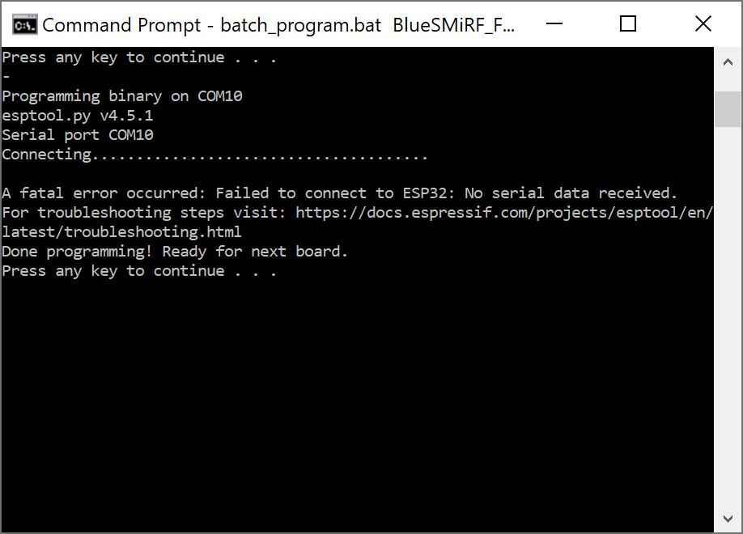

!!! warning "Need Help?"
	If you need technical assistance or more information on a product that is not working as you expected, we recommend heading on over to the [SparkFun Forums](https://community.sparkfun.com).


	!!! info "Account Registration Required"
		If this is your first visit to our forum, you'll need to create a [Forum Account](https://community.sparkfun.com/signup) to post questions.


### Issues Uploading Code Manually via CLI

If you are seeing the following error when attempting to flash the binaries:


<figure markdown>
[{ width="600" }](./assets/img/Error_Programming_BlueSMiRF_ESP32.JPG "Click to enlarge")
<figcaption markdown>Error Programming BlueSMiRF v2 - ESP32</figcaption>
</figure>


!!! terminal "Error Message"
	```sh
	A fatal error occurred: Failed to connect to ESP32: No serial data received. For troubleshooting steps visit: https://docs.espressif.com/projects/esptool/en/latest/troubleshooting.md_in_html
	Done programming! Ready for next board.
	Press any key to continue . . .
	```


Make sure to:

- The wires are making connection and not loose
- The wiring for USB-to-Serial Converter is connected properly the BlueSMiRF v2
- The proper COM Port is utilized for the USB-to-Serial converter, as enumerated to on your computer
- The appropriate USB drivers ar installed for the USB-to-Serial converter
- The BlueSMiRF v2 is in Bootloader Mode

Still having issues? Try a power cycle by following the steps below:

1. Disconnect the USB-to-serial converter from your computer
1. Hold down on the ++"PAIR"++ button, to force the BlueSMiRF v2 into bootloader mode
1. While holding the ++"PAIR"++ button, reconnect the USB-to-serial converter back to your computer
1. Release the ++"PAIR"++ button


### Can the BlueSMiRF v2 be used for wireless serial upload with an Arduino?
Currently, there is not support for wireless serial upload with an Arduino. We recommend removing the BlueSMiRF v2 and using a USB-to-serial converter to upload code to an Arduino.
